# 2段奶粉对比

## 各大系列奶粉基础信息对比

|品牌|类名|奶源|购买链接|价格（京东自营单罐）|广告语|执行标准| 配方表 |营养成分含量表|
| --- | --- | --- | --- | --- | --- |-----| --- | --- |
| 美素佳儿 |皇家|荷兰|[1](https://item.jd.com/8444261.html?pcdk=EEqYruRHpZfR9ilC3i9KXGMydQDoV3t3RxhLoFi_pzLBz2uQAv04wIUpjxzd4uqn.3z6a.aI3x&spmTag=YTAyMTkuYjAwMjM1Ni5jMDAwMDcyMTAua2V5d29yZF9lbnRlciU0MDE3Nzk4NjA2NDAzMDIlMjMxNzU4OTAzMzM3NDkwMjA5NDA5NjU5MiUyMzIwODEyMzE5ODYlMkNhMDI0MC5iMDAyNDkzLmMwMDAwNDAyNy40JTIzc2t1X2NhcmQlNDAxNzc5ODYwNzU2ODg4JTIzMTc1ODkwMzMzNzQ5MDIwOTQwOTY1OTIlMjMxNjI4NjMwODk5)|=350/800 ≈ 0.438 元/g| 乳铁蛋白、新国标 | 10766-2021 | 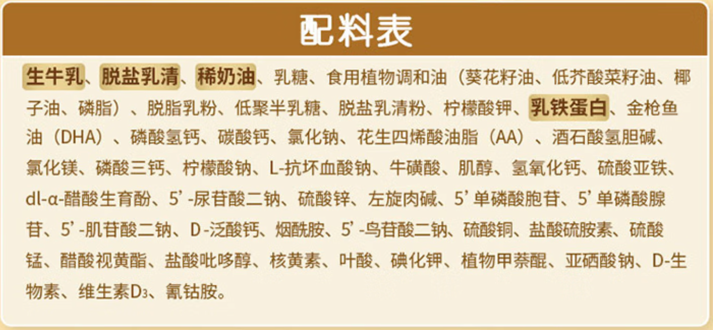 | 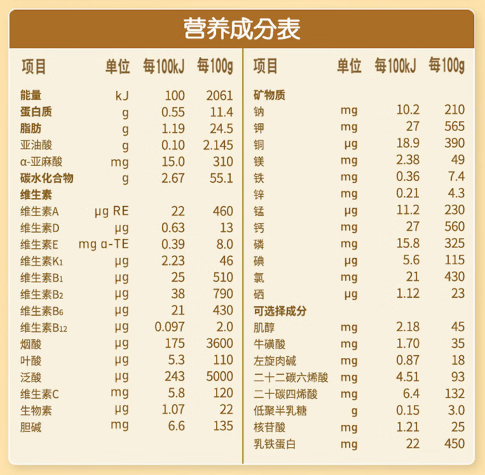 |
| 美素佳儿 |源悦|荷兰|[2](https://item.jd.com/100040095274.html?pcdk=uqksVAhoCe4oNVedIIO-49urrdsu_aw7RLM7PDo7zrQXKKL5GigNUSCOtjDvOSet.rQ4a.tlbT&spmTag=YTAyMTkuYjAwMjM1Ni5jMDAwMDcyMTAua2V5d29yZF9lbnRlciU0MDE3Nzk4NjA2NDAzMDIlMjMxNzU4OTAzMzM3NDkwMjA5NDA5NjU5MiUyMzIwODEyMzE5ODYlMkNhMDI0MC5iMDAyNDkzLmMwMDAwNDAyNy42JTIzc2t1X2NhcmQlNDAxNzc5ODYxMzk1ODQ3JTIzMTc1ODkwMzMzNzQ5MDIwOTQwOTY1OTIlMjMyMDAzMjEwNzcx#switch-sku)|=240/800 ≈ 0.300 元/g| 新国标 | 10766-2021 | 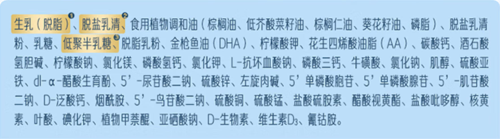 | 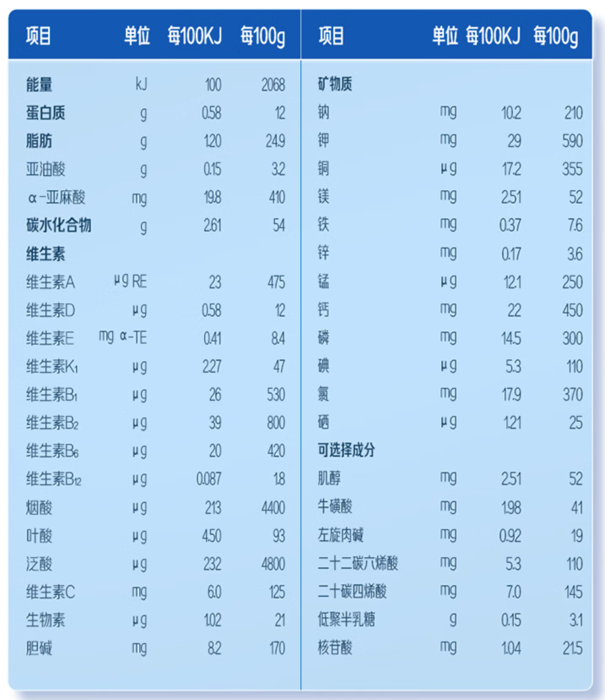 |
| 美素佳儿 |皇家莼悦|荷兰|[3](https://item.jd.com/100187725362.html?pcdk=gXlZ00r0vzp6iq9-9_KOuEZBmNeKoQhYTNlbmTcxAxgnWY52PO6t_mNh5RzXgAdZ.rQ4a.tlbT&spmTag=YTAyMTkuYjAwMjM1Ni5jMDAwMDcyMTAua2V5d29yZF9lbnRlciU0MDE3Nzk4NjA2NDAzMDIlMjMxNzU4OTAzMzM3NDkwMjA5NDA5NjU5MiUyMzIwODEyMzE5ODYlMkNhMDI0MC5iMDAyNDkzLmMwMDAwNDAyNy41JTIzc2t1X2NhcmQlNDAxNzc5ODYxNjYyMDc5JTIzMTc1ODkwMzMzNzQ5MDIwOTQwOTY1OTIlMjM0MDc1MTk3MTA#switch-sku)|=369/800 ≈ 0.461 元/g| 有机 | 10766-2021 | 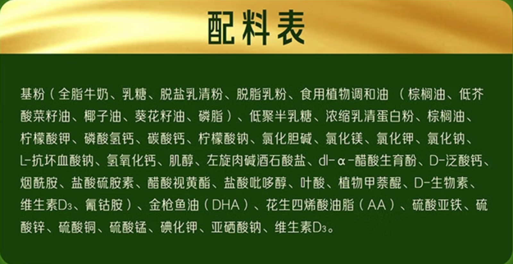 | 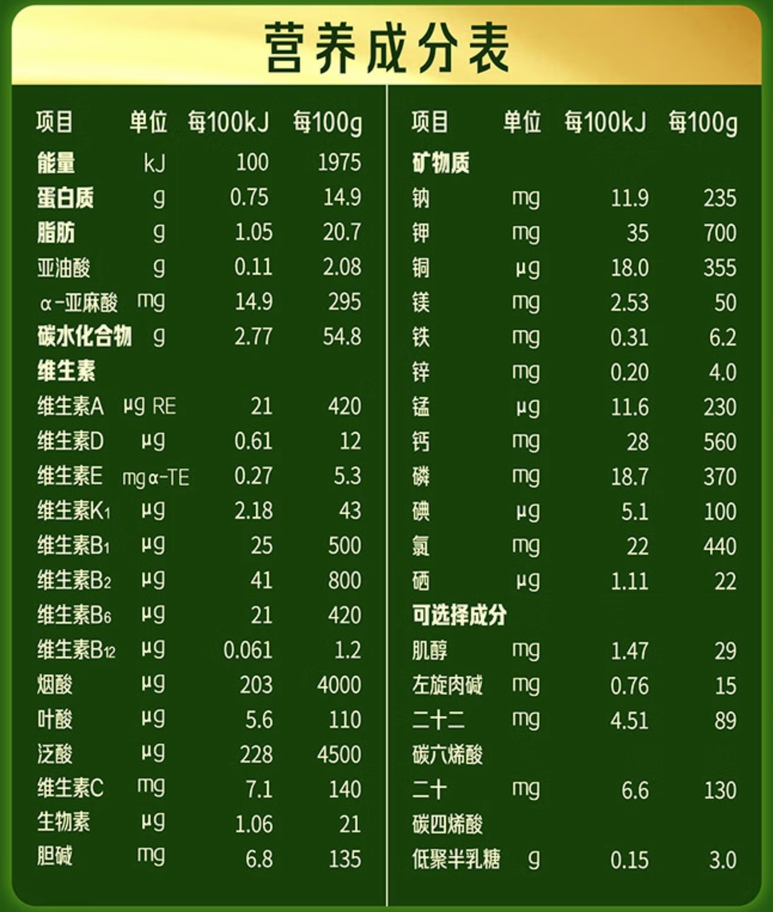 |
| 美素佳儿 |皇家（港版）|荷兰|[4](https://npcitem.jd.hk/100005794932.html?pcdk=YjPixfEpJqwSCxhDyCBoUjK_p_bagGtUedwPtA_owCJlcZdCKracUQePEVRMQn1S.3z6a.aI3x&spmTag=YTAyMTkuYjAwMjM1Ni5jMDAwMDcyMTAua2V5d29yZF9lbnRlciU0MDE3Nzk4NjA2NDAzMDIlMjMxNzU4OTAzMzM3NDkwMjA5NDA5NjU5MiUyMzIwODEyMzE5ODYlMkNhMDI0MC5iMDAyNDkzLmMwMDAwNDAyNy40JTIzc2t1X2NhcmQlNDAxNzc5ODYxOTYwOTE0JTIzMTc1ODkwMzMzNzQ5MDIwOTQwOTY1OTIlMjMxMDkxNzk2MzM3)|=348/800 ≈ 0.435 元/g| HMO 配方 | - | 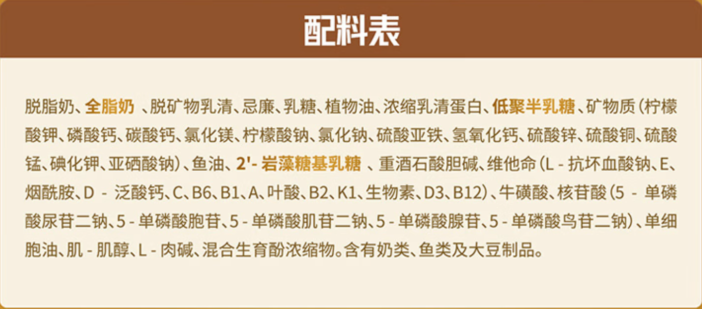 | 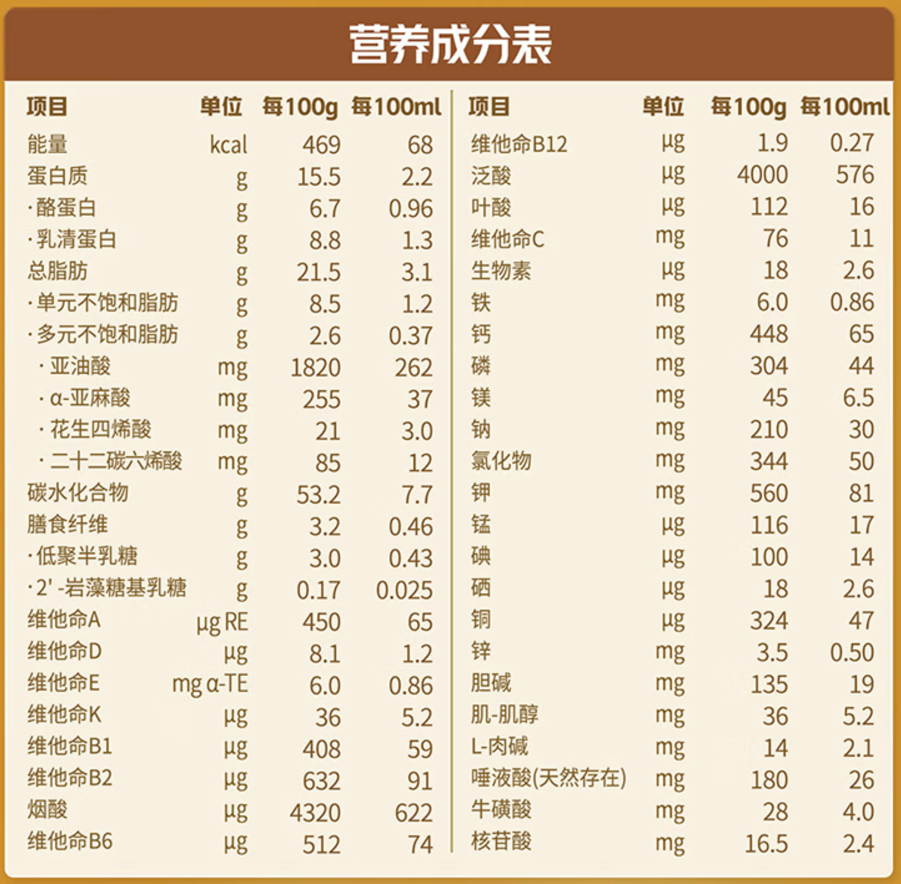 |
| 飞鹤 |迹萃|国产|[5](https://item.jd.com/100228043771.html?pcdk=OBoHq8N5SMrUE8RiNZ10G5e-fplexMFwo24aMEAt625dzDe1NWTLDda0-RnhB48O.rQ4a.tlbT&spmTag=YTAyMTkuYjAwMjM1Ni5jMDAwMDcyMTAua2V5d29yZF9lbnRlciU0MDE3Nzk4NjA2NDAzMDIlMjMxNzU4OTAzMzM3NDkwMjA5NDA5NjU5MiUyMzIwODEyMzE5ODYlMkNhMDI0MC5iMDAyNDkzLmMwMDAwNDAyNy4xJTIzc2t1X2NhcmQlNDAxNzc5ODYyMTYwMDc0JTIzMTc1ODkwMzMzNzQ5MDIwOTQwOTY1OTIlMjM1Nzc3NjcxMjM#switch-sku)|=369/750 ≈ 0.492 元/g| 乳铁蛋白8HMOs | 10766-2021 | 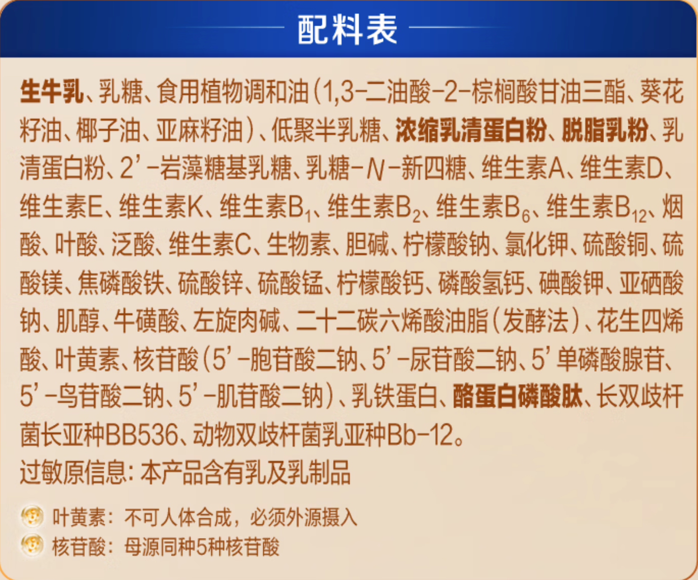 | 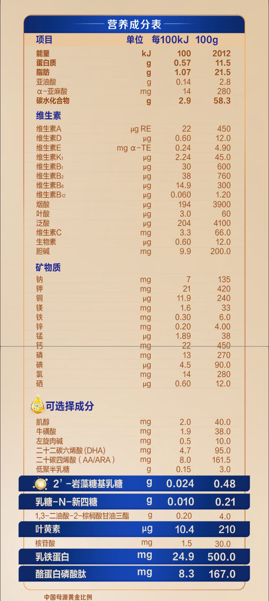 |
| 飞鹤 |启萃|国产|[6](https://item.jd.com/100304318086.html?pcdk=5_gT-nOI-NLZmTqQj0QiS_7eMabWj5CcHDtS-ROz1_Xp0hiVKl5f8CiWRKhyL38T.rQ4a.tlbT&spmTag=YTAyMTkuYjAwMjM1Ni5jMDAwMDcyMTAua2V5d29yZF9lbnRlciU0MDE3Nzk4NjA2NDAzMDIlMjMxNzU4OTAzMzM3NDkwMjA5NDA5NjU5MiUyMzIwODEyMzE5ODYlMkNhMDI0MC5iMDAyNDkzLmMwMDAwNDAyNy4xJTIzc2t1X2NhcmQlNDAxNzc5ODYyMTYwMDc0JTIzMTc1ODkwMzMzNzQ5MDIwOTQwOTY1OTIlMjM1Nzc3NjcxMjM#switch-sku)|=293/750 ≈ 0.391 元/g| DHA8种HMO乳铁蛋白 | 10766-2021 | 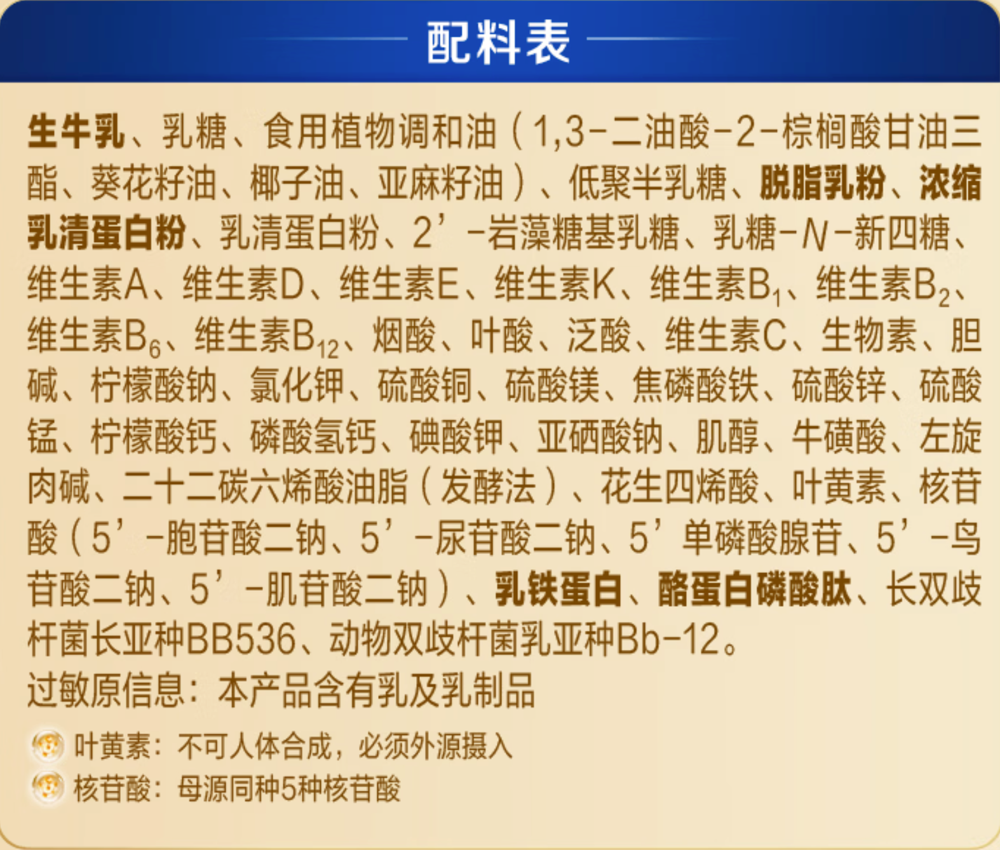 | 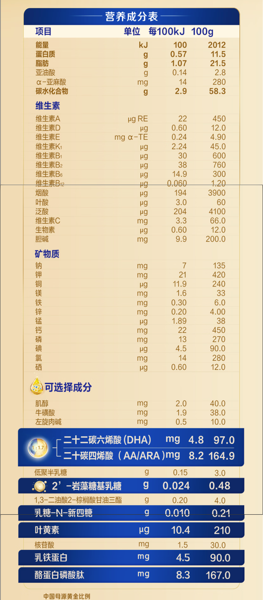 |
| 飞鹤 |星飞帆-卓睿（HMO升级版）|国产|[7](https://item.jd.com/100031122654.html?pcdk=P6KylaotDgfroynu1eLoUJ7XAOjq6bTAQpaXk3Zv8TojvDSz5Xi7YgZLF9OZKJIJ.rQ4a.tlbT&spmTag=YTAyMTkuYjAwMjM1Ni5jMDAwMDcyMTAua2V5d29yZF9lbnRlciU0MDE3Nzk4NjA2NDAzMDIlMjMxNzU4OTAzMzM3NDkwMjA5NDA5NjU5MiUyMzIwODEyMzE5ODYlMkNhMDI0MC5iMDAyNDkzLmMwMDAwNDAyNy4xJTIzc2t1X2NhcmQlNDAxNzc5ODYyMTYwMDc0JTIzMTc1ODkwMzMzNzQ5MDIwOTQwOTY1OTIlMjM1Nzc3NjcxMjM#switch-sku)|=258/750 ≈ 0.344 元/g| 乳铁蛋白 | 10766-2021 | 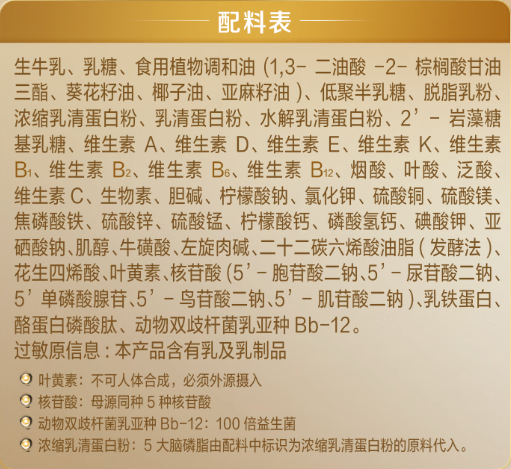 | 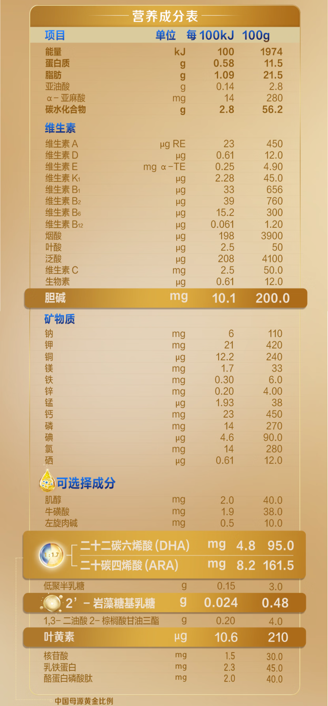 |
| 飞鹤 |星飞帆-卓睿Pro|国产|[8](https://item.jd.com/100069293021.html?pcdk=Ck2KEsmjogepdtoR_VcvJ3yx7HIAbeqfPBqFK9FE3Og03TH4ySwVt-gjwsw-KcSS.rQ4a.tlbT&spmTag=YTAyMTkuYjAwMjM1Ni5jMDAwMDcyMTAua2V5d29yZF9lbnRlciU0MDE3Nzk4NjA2NDAzMDIlMjMxNzU4OTAzMzM3NDkwMjA5NDA5NjU5MiUyMzIwODEyMzE5ODYlMkNhMDI0MC5iMDAyNDkzLmMwMDAwNDAyNy4xJTIzc2t1X2NhcmQlNDAxNzc5ODYyMTYwMDc0JTIzMTc1ODkwMzMzNzQ5MDIwOTQwOTY1OTIlMjM1Nzc3NjcxMjM#switch-sku)|=296/758 ≈ 0.391 元/g|  | 10766-2021 | 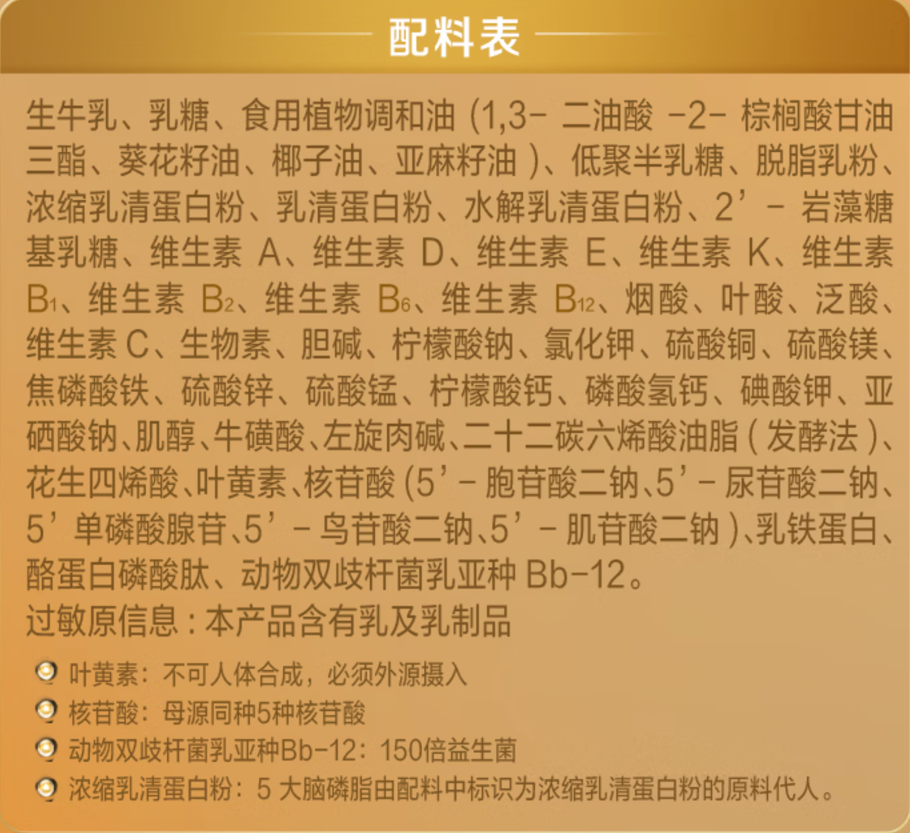 |  |
| 飞鹤 |星飞帆-卓耀|国产|[9](https://item.jd.com/100043100443.html?pcdk=a0SQ-hbN1vUfT_xOT8p8x7nbnigILV89vtwk9BOlUQ1552T7JYa-ctOZfPuJbxye.3z6a.aI3x&spmTag=YTAyMTkuYjAwMjM1Ni5jMDAwMDcyMTAua2V5d29yZF9lbnRlciU0MDE3Nzk4NjA2NDAzMDIlMjMxNzU4OTAzMzM3NDkwMjA5NDA5NjU5MiUyMzIwODEyMzE5ODYlMkNhMDI0MC5iMDAyNDkzLmMwMDAwNDAyNy43JTIzc2t1X2NhcmQlNDAxNzc5ODYzMDI5NDQzJTIzMTc1ODkwMzMzNzQ5MDIwOTQwOTY1OTIlMjMxNDk4NjEyNzY1)|=240/750 ≈ 0.320 元/g| A2 β-酪蛋白奶源版 |  | 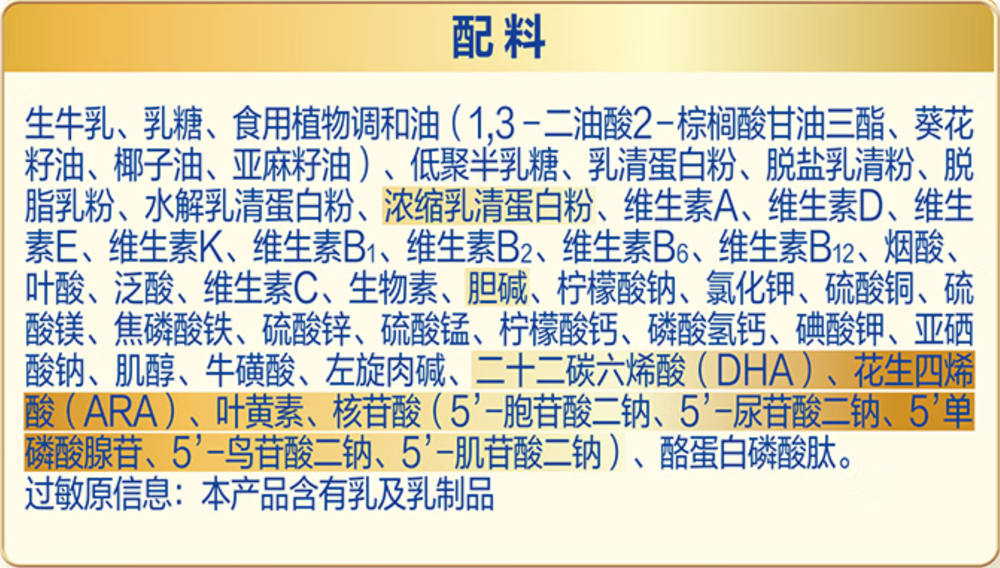 | 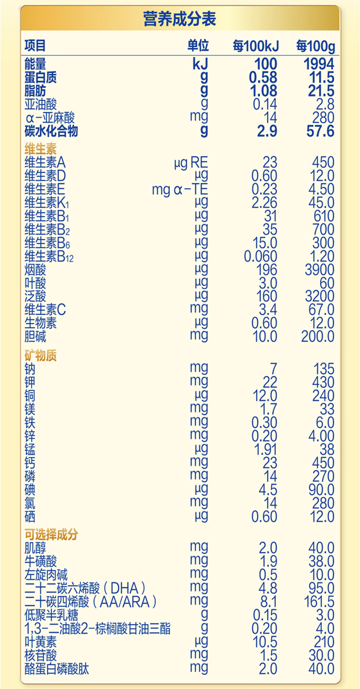 |
| 飞鹤 |星飞帆|国产|[10](https://item.jd.com/100030961056.html?pcdk=V_bFuBxE2etIlf2ayrZK6zcRoTvmD-au6sa9gX5sltpEahOrcbKo7gm0KN-ek8S4.rQ4a.tlbT&spmTag=YTAyMTkuYjAwMjM1Ni5jMDAwMDcyMTAua2V5d29yZF9lbnRlciU0MDE3Nzk4NjA2NDAzMDIlMjMxNzU4OTAzMzM3NDkwMjA5NDA5NjU5MiUyMzIwODEyMzE5ODYlMkNhMDI0MC5iMDAyNDkzLmMwMDAwNDAyNy4yMiUyM3NrdV9jYXJkJTQwMTc3OTg2MzI3ODYxMSUyMzE3NTg5MDMzMzc0OTAyMDk0MDk2NTkyJTIzNjIyNzQ3NDk4#switch-sku)|=260/900 ≈ 0.289 元/g| HMOs专利OPO |  | 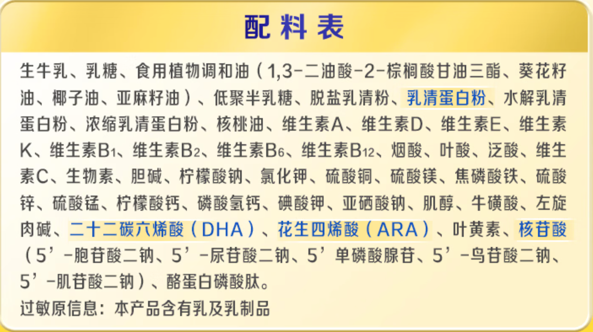 | 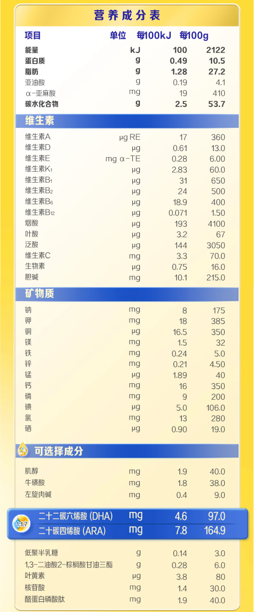 |
| 飞鹤 |臻稚卓蓓|国产|[11](https://item.jd.com/100259748457.html?pcdk=a0SQ-hbN1vUfT_xOT8p8x_fwnVOpW0XIWpNDP566uD67-7wac8hxajydg7i97-Dh.3z6a.aI3x&spmTag=YTAyMTkuYjAwMjM1Ni5jMDAwMDcyMTAua2V5d29yZF9lbnRlciU0MDE3Nzk4NjA2NDAzMDIlMjMxNzU4OTAzMzM3NDkwMjA5NDA5NjU5MiUyMzIwODEyMzE5ODYlMkNhMDI0MC5iMDAyNDkzLmMwMDAwNDAyNy41JTIzc2t1X2NhcmQlNDAxNzc5ODYzNTM2ODQwJTIzMTc1ODkwMzMzNzQ5MDIwOTQwOTY1OTIlMjMyOTEwNjA2Ng)|=298/700 ≈ 0.426 元/g| 有机-8倍乳铁蛋白6重HMO |  | 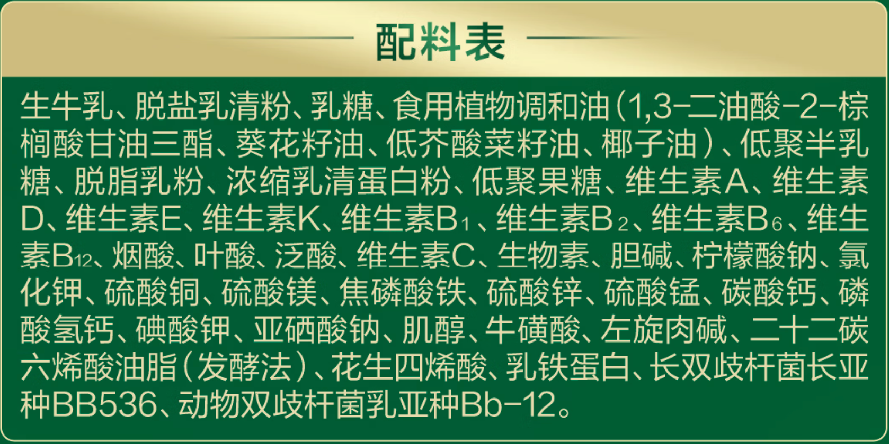 | 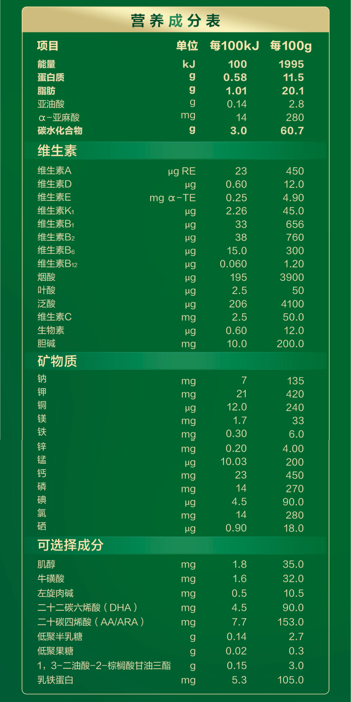 |
| 合生元 |派星|法国|[12](https://item.jd.com/100012821842.html?pcdk=OiSTlrk6EVuo927NmC0yyi71LB1T82ngcM0CHZd5Z_IuG1_x1KIexoGhXvLGVuFg.rQ4a.tlbT&spmTag=YTAyMTkuYjAwMjM1Ni5jMDAwMDcyMTAua2V5d29yZF9lbnRlciU0MDE3Nzk4NjA2NDAzMDIlMjMxNzU4OTAzMzM3NDkwMjA5NDA5NjU5MiUyMzIwODEyMzE5ODYlMkNhMDI0MC5iMDAyNDkzLmMwMDAwNDAyNy4xJTIzc2t1X2NhcmQlNDAxNzc5ODYzNzE2MjQ5JTIzMTc1ODkwMzMzNzQ5MDIwOTQwOTY1OTIlMjMxOTQ3NjU2NTUy#switch-sku)|=318/800 ≈ 0.398 元/g|  |  | 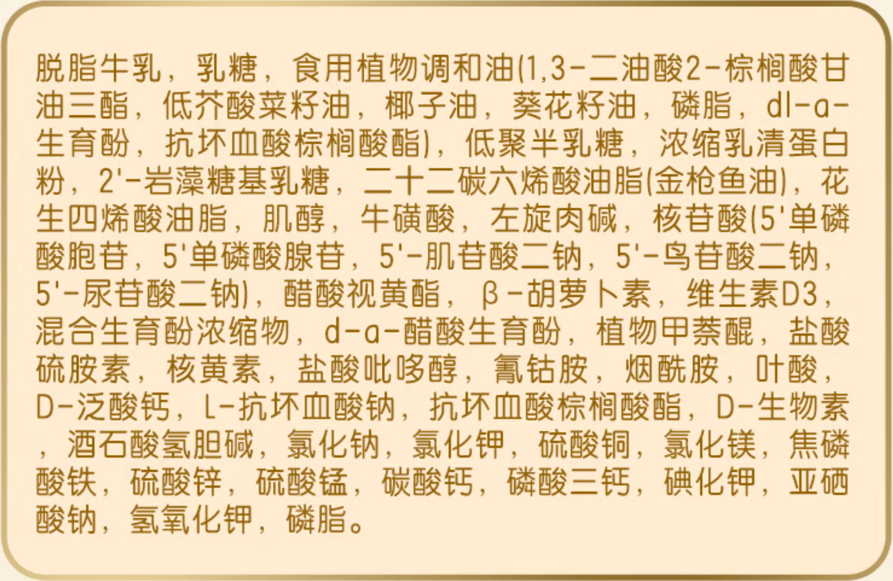 | 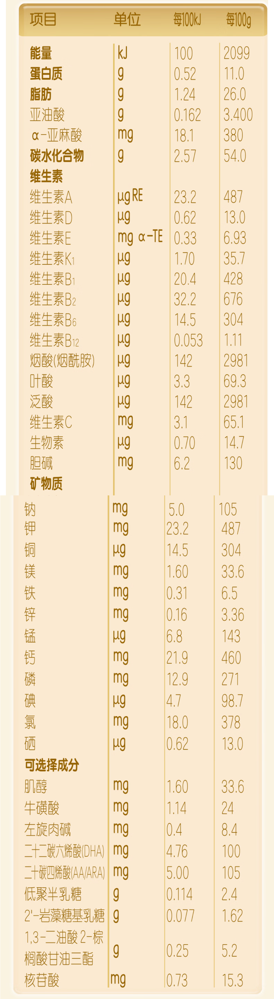 |
| 合生元 |派星天呵|法国|[13](https://item.jd.com/100068724755.html?pcdk=-3UT_5TLe8yxAKG_JuKdjE911qh_kXHbxFJXDFbEWZ0hTG4y1xkdn1e4XbjTvda_.rQ4a.tlbT&spmTag=YTAyMTkuYjAwMjM1Ni5jMDAwMDcyMTAua2V5d29yZF9lbnRlciU0MDE3Nzk4NjA2NDAzMDIlMjMxNzU4OTAzMzM3NDkwMjA5NDA5NjU5MiUyMzIwODEyMzE5ODYlMkNhMDI0MC5iMDAyNDkzLmMwMDAwNDAyNy4xJTIzc2t1X2NhcmQlNDAxNzc5ODYzNzE2MjQ5JTIzMTc1ODkwMzMzNzQ5MDIwOTQwOTY1OTIlMjMxOTQ3NjU2NTUy#switch-sku)|=338/800 ≈ 0.422 元/g|  |  | 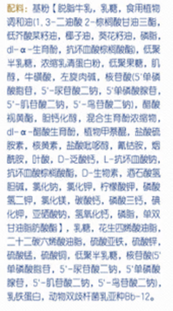 | 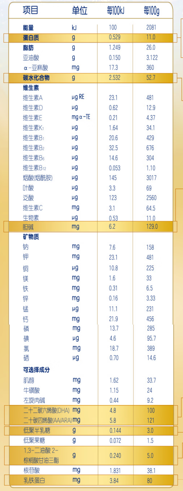 |
| 合生元 |贝塔星耀|丹麦|[14](https://item.jd.com/100100635754.html?pcdk=5mxbc6y73zzDeifPiMbrIfxs7ZoxVdHtP5WOpxuz8b8BzqhJvYp2CTMFjzCJVDqt.3z6a.aI3x&spmTag=YTAyMTkuYjAwMjM1Ni5jMDAwMDcyMTAua2V5d29yZF9lbnRlciU0MDE3Nzk4NjA2NDAzMDIlMjMxNzU4OTAzMzM3NDkwMjA5NDA5NjU5MiUyMzIwODEyMzE5ODYlMkNhMDI0MC5iMDAyNDkzLmMwMDAwNDAyNy43JTIzc2t1X2NhcmQlNDAxNzc5ODY0MzI4NjIyJTIzMTc1ODkwMzMzNzQ5MDIwOTQwOTY1OTIlMjMzOTY1OTAxNjQ)|=258/700 ≈ 0.369 元/g|  |  | 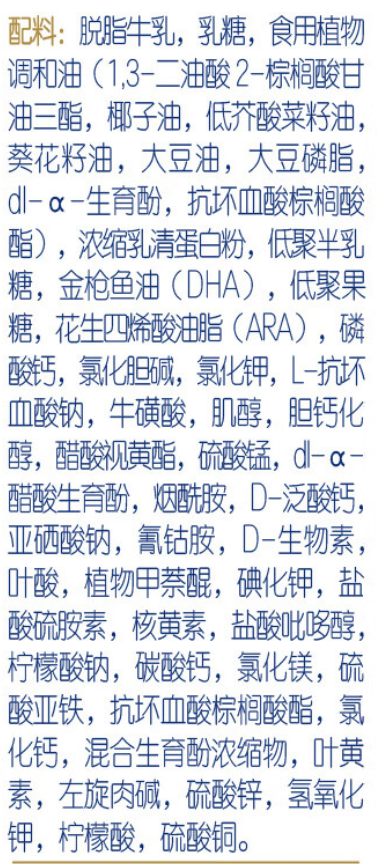 | 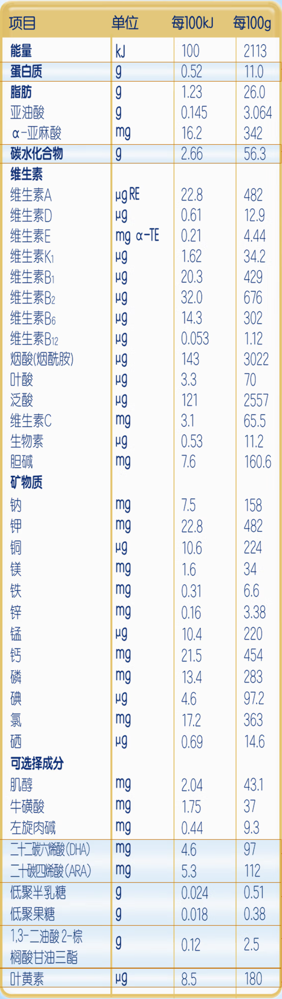 |
| 合生元 |可贝思亲呵|法国|[15](https://item.jd.com/100073639858.html?pcdk=uJTXyRg1kX-wNJlOXjKMa99a-tfAag3TryDtbyEI2HHPm9C90WGMBz3p8SC7ZbYW.3z6a.aI3x&spmTag=YTAyMTkuYjAwMjM1Ni5jMDAwMDcyMTAua2V5d29yZF9lbnRlciU0MDE3Nzk4NjA2NDAzMDIlMjMxNzU4OTAzMzM3NDkwMjA5NDA5NjU5MiUyMzIwODEyMzE5ODYlMkNhMDI0MC5iMDAyNDkzLmMwMDAwNDAyNy4yMiUyM3NrdV9jYXJkJTQwMTc3OTg2NDYwMTk0MCUyMzE3NTg5MDMzMzc0OTAyMDk0MDk2NTkyJTIzMTY2Mjg4ODgwNA)|=298/700 ≈ 0.426 元/g| 羊奶粉 |  |     | 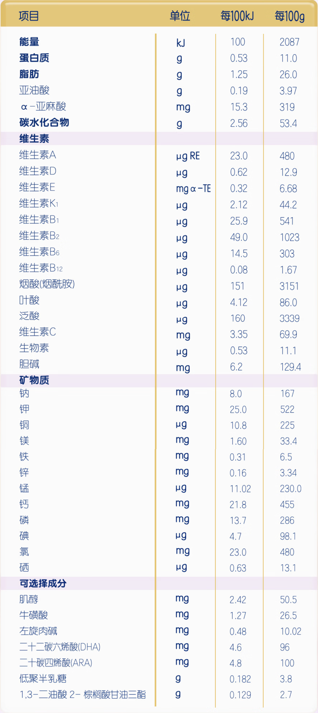 |
| 伊利金领冠 |塞纳牧|国产|[16](https://item.jd.com/100006002934.html?pcdk=qrpTpmzP8XbZUhohenQdE7tIJMCIyAAyi2QIEZke7vqkWPPXuIEWrhOg_hceh3Vd.3z6a.aI3x&spmTag=YTAyMTkuYjAwMjM1Ni5jMDAwMDcyMTAua2V5d29yZF9lbnRlciU0MDE3Nzk4NjA2NDAzMDIlMjMxNzU4OTAzMzM3NDkwMjA5NDA5NjU5MiUyMzIwODEyMzE5ODYlMkNhMDI0MC5iMDAyNDkzLmMwMDAwNDAyNy4yJTIzc2t1X2NhcmQlNDAxNzc5ODY0ODkzMDM3JTIzMTc1ODkwMzMzNzQ5MDIwOTQwOTY1OTIlMjMyMDI0NzgwODQ4)|=290/800 ≈ 0.362 元/g| 有机A2β-酪蛋白 |  | 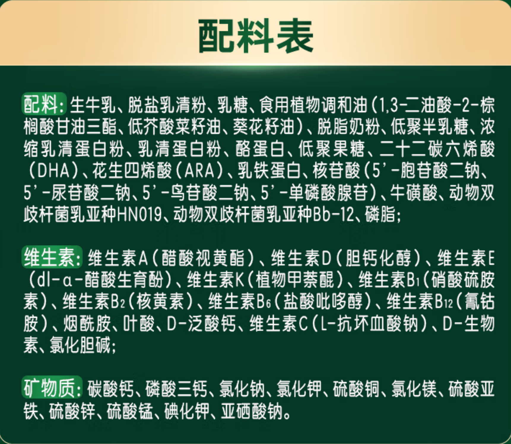 | 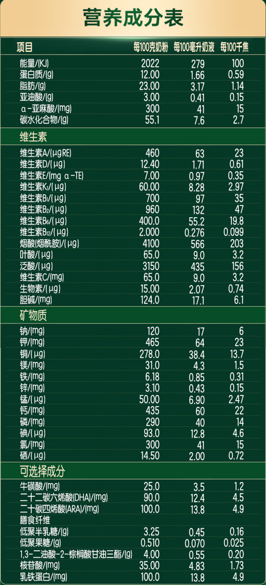 |
| 伊利金领冠 |育护||[17](https://item.jd.com/3300187.html?pcdk=qrpTpmzP8XbZUhohenQdE7SfNScqxPEcp3LXDDZBGFRzmzITGYfI0aPoCu7JFH68.3z6a.aI3x&spmTag=YTAyMTkuYjAwMjM1Ni5jMDAwMDcyMTAua2V5d29yZF9lbnRlciU0MDE3Nzk4NjA2NDAzMDIlMjMxNzU4OTAzMzM3NDkwMjA5NDA5NjU5MiUyMzIwODEyMzE5ODYlMkNhMDI0MC5iMDAyNDkzLmMwMDAwNDAyNy4xMSUyM3NrdV9jYXJkJTQwMTc3OTg2NTA4ODY4MiUyMzE3NTg5MDMzMzc0OTAyMDk0MDk2NTkyJTIzMjc1MTc0MzM4)|=178/960 ≈ 0.185 元/g| 5倍DHA |  | 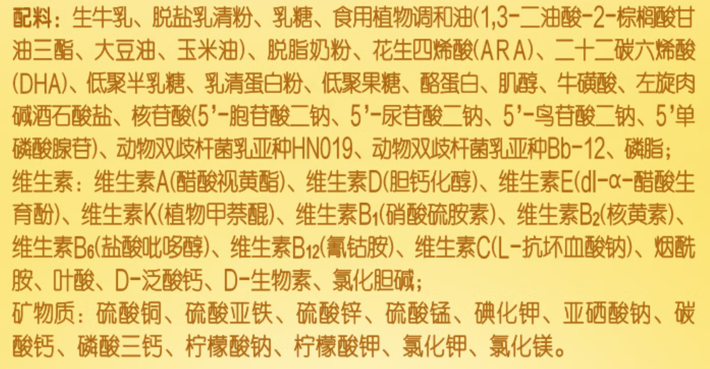 | 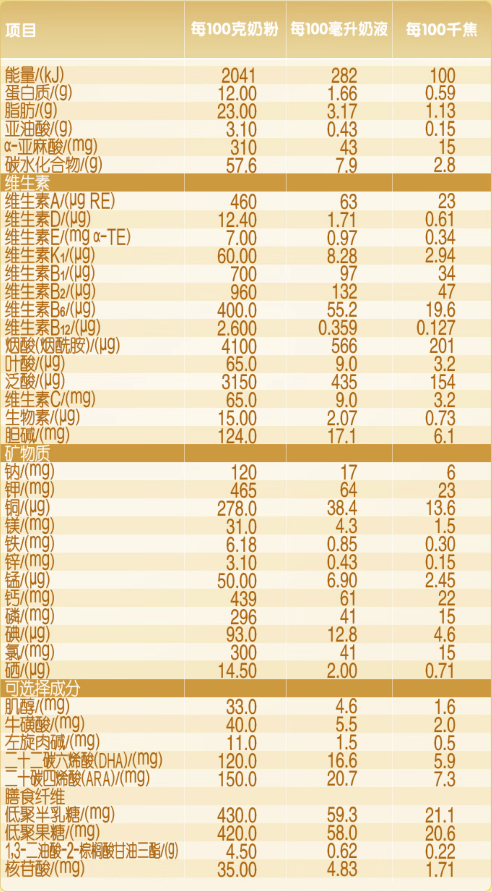 |
| 伊利金领冠 |珍护||[18](https://item.jd.com/100113873066.html?pcdk=qrpTpmzP8XbZUhohenQdE0-eD3X2hO6qPAWugZ01By632IfRprcW7YXJ5eUTwhvr.3z6a.aI3x&spmTag=YTAyMTkuYjAwMjM1Ni5jMDAwMDcyMTAua2V5d29yZF9lbnRlciU0MDE3Nzk4NjA2NDAzMDIlMjMxNzU4OTAzMzM3NDkwMjA5NDA5NjU5MiUyMzIwODEyMzE5ODYlMkNhMDI0MC5iMDAyNDkzLmMwMDAwNDAyNy4xMiUyM3NrdV9jYXJkJTQwMTc3OTg2NTA4OTUzNiUyMzE3NTg5MDMzMzc0OTAyMDk0MDk2NTkyJTIzOTA0MDYzNDE4)|=265/900 ≈ 0.294 元/g| HMO乳源 |  | 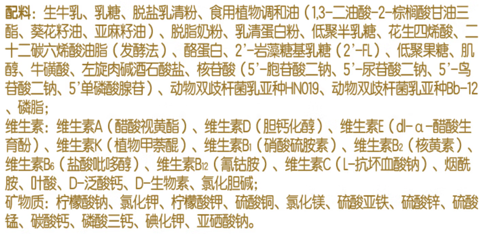 | 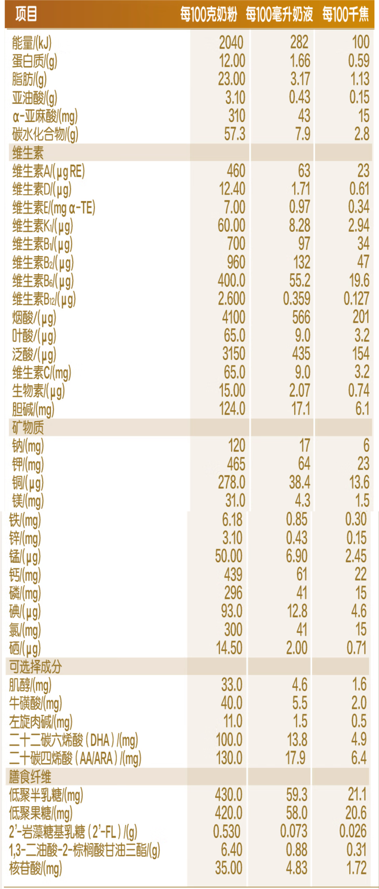 |
| 伊利金领冠 |菁护||[19](https://item.jd.com/3279961.html?pcdk=qrpTpmzP8XbZUhohenQdExeXYQ8UGwTGODjZ9ue0ZLY2wjLSVlo37BPD23BxUH4Z.3z6a.aI3x&spmTag=YTAyMTkuYjAwMjM1Ni5jMDAwMDcyMTAua2V5d29yZF9lbnRlciU0MDE3Nzk4NjA2NDAzMDIlMjMxNzU4OTAzMzM3NDkwMjA5NDA5NjU5MiUyMzIwODEyMzE5ODYlMkNhMDI0MC5iMDAyNDkzLmMwMDAwNDAyNy44JTIzc2t1X2NhcmQlNDAxNzc5ODY1MDk3NDI3JTIzMTc1ODkwMzMzNzQ5MDIwOTQwOTY1OTIlMjMxMjcwMDAyNTg4)|=212/800 ≈ 0.265 元/g| A2β-酪蛋白 乳铁蛋白 |  | 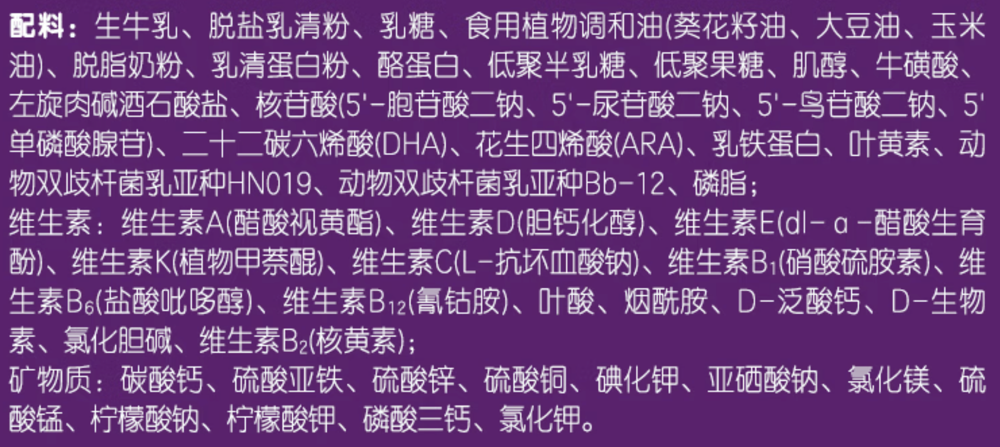 | 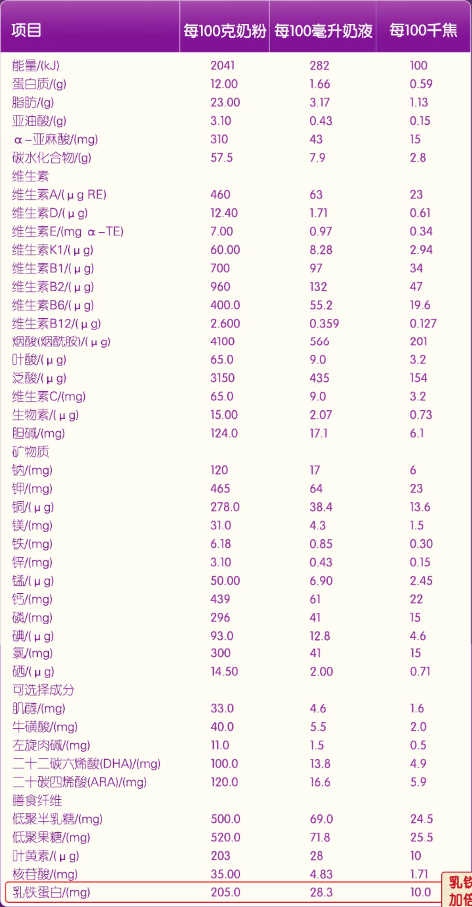 |
| 伊利金领冠 |珍护铂萃||[20](https://item.jd.com/100099696093.html?pcdk=IP3uqZM7cipOepfVH1ylxt0B8m3Q4RITRB38O1PpTfiy3DdikXKt3cAQS1lpxDlF.rQ4a.tlbT&spmTag=YTAyMTkuYjAwMjM1Ni5jMDAwMDcyMTAua2V5d29yZF9lbnRlciU0MDE3Nzk4NjA2NDAzMDIlMjMxNzU4OTAzMzM3NDkwMjA5NDA5NjU5MiUyMzIwODEyMzE5ODYlMkNhMDI0MC5iMDAyNDkzLmMwMDAwNDAyNy43JTIzc2t1X2NhcmQlNDAxNzc5ODY1MDk5ODkxJTIzMTc1ODkwMzMzNzQ5MDIwOTQwOTY1OTIlMjM2NDk3MDI1NDQ#switch-sku)|=279/750 ≈ 0.372 元/g| 超凡乳源HMOs |  | 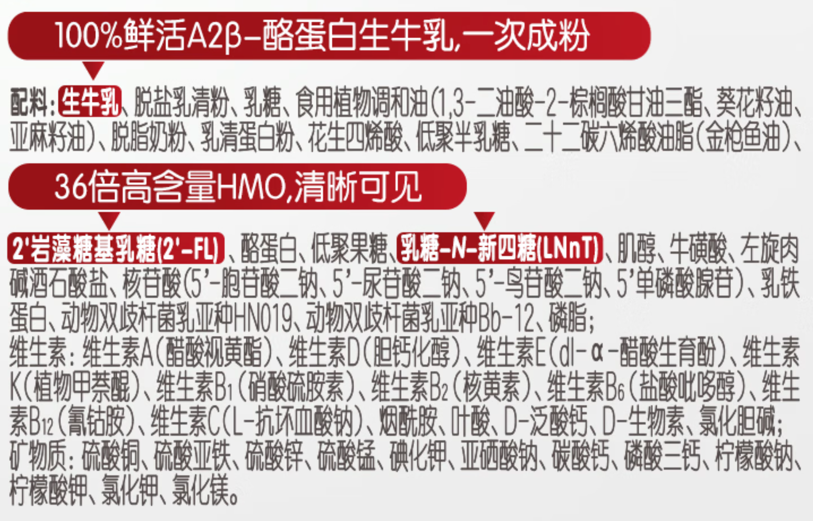 | 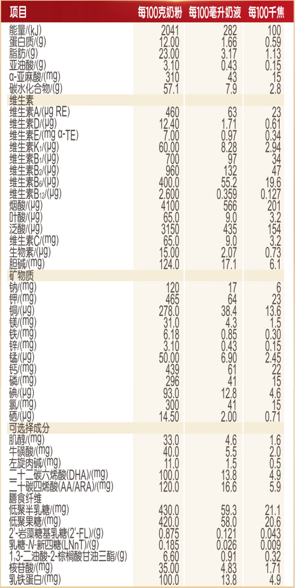 |
| 伊利金领冠 |珍护源初||[21](https://item.jd.com/100220679133.html?pcdk=sOZEkn0MaVYaLK7rVm_GTJi_Z2LcIhOOa4DkBsmldBSOiHvCh7EyMmAdKEe3491k.rQ4a.tlbT&spmTag=YTAyMTkuYjAwMjM1Ni5jMDAwMDcyMTAua2V5d29yZF9lbnRlciU0MDE3Nzk4NjA2NDAzMDIlMjMxNzU4OTAzMzM3NDkwMjA5NDA5NjU5MiUyMzIwODEyMzE5ODYlMkNhMDI0MC5iMDAyNDkzLmMwMDAwNDAyNy4yOCUyM3NrdV9jYXJkJTQwMTc3OTg2NTExNzY1NyUyMzE3NTg5MDMzMzc0OTAyMDk0MDk2NTkyJTIzMTg0NTQxNDkxOA#switch-sku)|=378/750 ≈ 0.504 元/g| 有机A2β-酪蛋白/hmo/乳铁蛋白 |  | 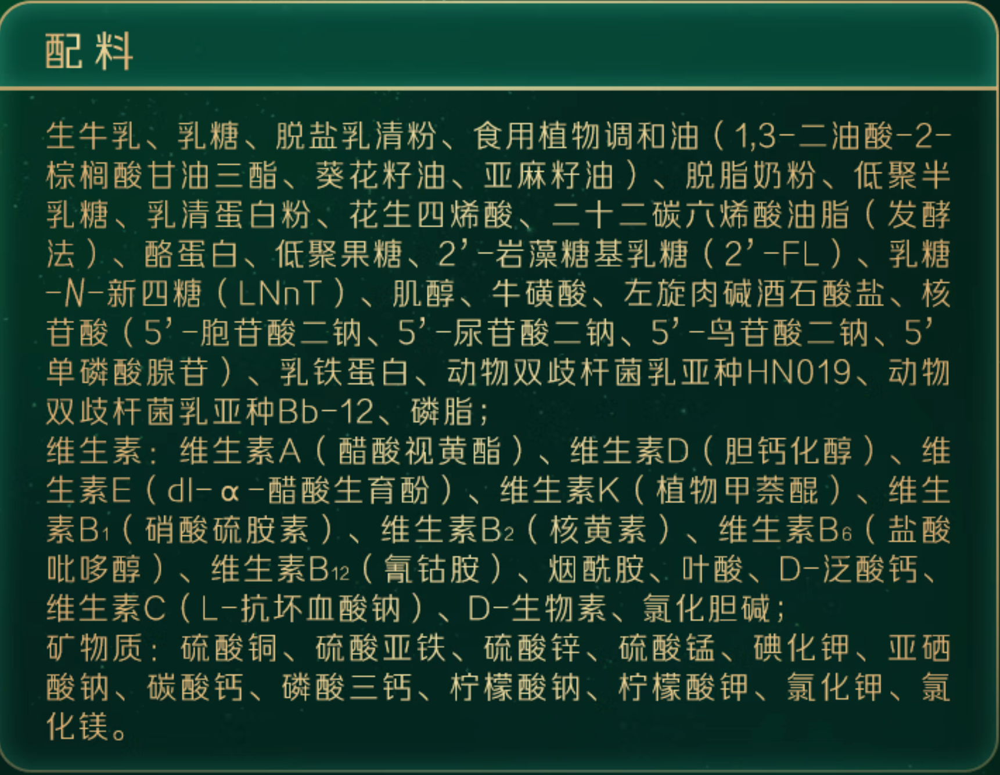 | 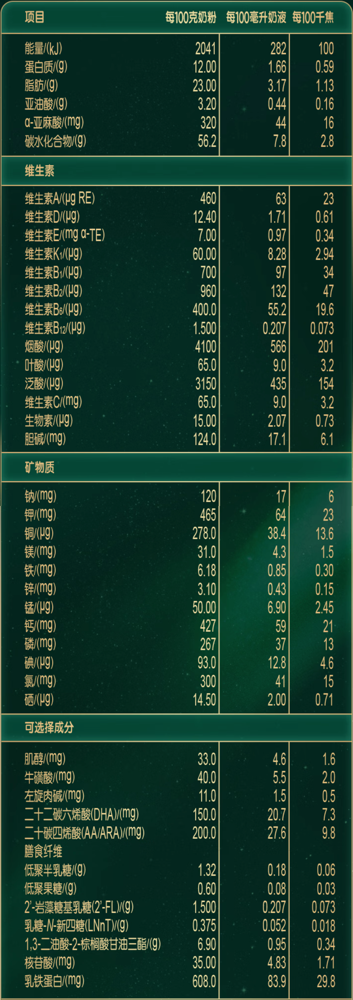 |
| a2 |紫白金||[22](https://npcitem.jd.hk/100030631109.html?pcdk=WyQslnIr___Gy64WCOPb3hblvJ5IcsqdWt82qo0Mw3ajUjDwXgWPdClm5OU-8RmM.rQ4a.tlbT&spmTag=YTAyMTkuYjAwMjM1Ni5jMDAwMDcyMTAua2V5d29yZF9lbnRlciU0MDE3Nzk4NjA2NDAzMDIlMjMxNzU4OTAzMzM3NDkwMjA5NDA5NjU5MiUyMzIwODEyMzE5ODYlMkNhMDI0MC5iMDAyNDkzLmMwMDAwNDAyNy4xJTIzc2t1X2NhcmQlNDAxNzc5ODY2MTk4NTAyJTIzMTc1ODkwMzMzNzQ5MDIwOTQwOTY1OTIlMjMyNTM5ODA5Mw#switch-sku)|=230/900 ≈ 0.256 元/g|  |  | 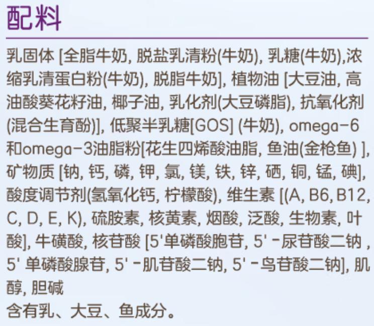 | 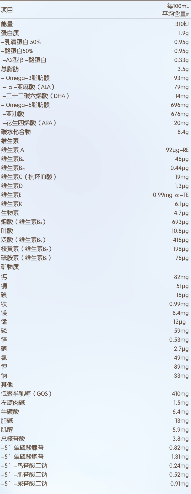 |
| a2 |紫曜||[23](https://npcitem.jd.hk/100341041848.html?pcdk=VofXJ7NMxaHyrHOPonGVZ0_apE8V4G0rwsYhc3RnVZEy5670Ap6RWvaXquLZUaHX.rQ4a.tlbT&spmTag=YTAyMTkuYjAwMjM1Ni5jMDAwMDcyMTAua2V5d29yZF9lbnRlciU0MDE3Nzk4NjA2NDAzMDIlMjMxNzU4OTAzMzM3NDkwMjA5NDA5NjU5MiUyMzIwODEyMzE5ODYlMkNhMDI0MC5iMDAyNDkzLmMwMDAwNDAyNy4xJTIzc2t1X2NhcmQlNDAxNzc5ODY2MTk4NTAyJTIzMTc1ODkwMzMzNzQ5MDIwOTQwOTY1OTIlMjMyNTM5ODA5Mw#switch-sku)|=315/800 ≈ 0.394 元/g|  |  | 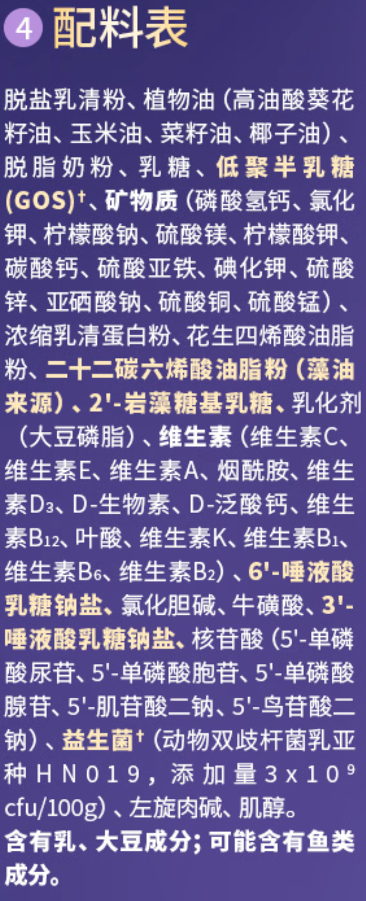 | 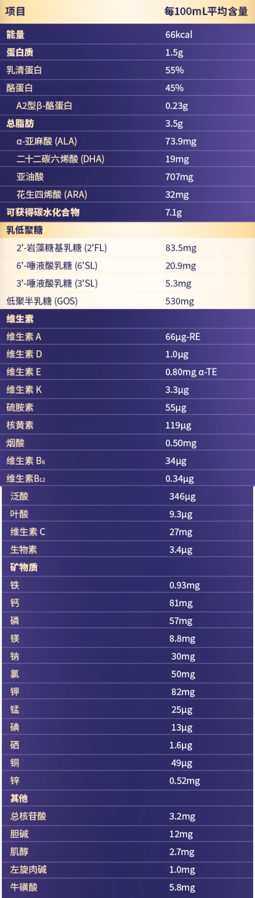 |

## 营养成分细分（每 100kJ）

> 口径：国标基准来自 [2021 国标-乳基婴儿配方食品关键指标（每100kJ）](./11-0-奶粉.md)。
> 
> 有上下限的项目取中间值为对比基准；只有下限或上限的项目分别以下限或上限为基准。↑ 表示高于基准，↓ 表示低于基准。
> 
> 港版和 a2 等只标每100g/每100mL的截图，已按能量和单位折算到每100kJ。
>
> 表头颜色：宏量营养素、维生素、矿物质、国标可选择成分、非国标专项成分（当前引用的国标关键指标未设定限值）。

| 品牌 | 系列 | 蛋白质 | 脂肪 | 亚油酸 | α-亚麻酸 | 碳水化合物 | 维生素A | 维生素D | 维生素E | 维生素K1 | 维生素B1 | 维生素B2 | 维生素B6 | 维生素B12 | 烟酸 | 叶酸 | 泛酸 | 维生素C | 生物素 | 胆碱 | 钠 | 钾 | 铜 | 镁 | 铁 | 锌 | 锰 | 钙 | 磷 | 碘 | 氯 | 硒 | 肌醇 | 牛磺酸 | 左旋肉碱 | DHA | ARA | 低聚半乳糖 | 低聚果糖 | 2-FL | LNnT | 核苷酸 | 乳铁蛋白 | OPO |
| --- | --- | --- | --- | --- | --- | --- | --- | --- | --- | --- | --- | --- | --- | --- | --- | --- | --- | --- | --- | --- | --- | --- | --- | --- | --- | --- | --- | --- | --- | --- | --- | --- | --- | --- | --- | --- | --- | --- | --- | --- | --- | --- | --- | --- |
| 国标标准 | 每100kJ | 0.43-0.72g；基准0.575g | 1.05-1.43g；基准1.24g | 0.07-0.33g；基准0.20g | ≥12mg；基准12mg | 2.2-3.3g；基准2.75g | 14-36μg RE；基准25μg RE | 0.48-1.20μg；基准0.84μg | 0.12-1.20mg α-TE；基准0.66mg α-TE | 0.96-6.45μg；基准3.705μg | 14-72μg；基准43μg | 19-120μg；基准69.5μg | 8.4-41.8μg；基准25.1μg | 0.024-0.359μg；基准0.1915μg | 96-359μg；基准227.5μg | 2.9-12.0μg；基准7.45μg | 96-478μg；基准287μg | 2.4-16.7mg；基准9.55mg | 0.36-2.39μg；基准1.375μg | 4.8-23.9mg；基准14.35mg | 7-14mg；基准10.5mg | 17-43mg；基准30mg | 14.3-28.7μg；基准21.5μg | 1.2-3.6mg；基准2.4mg | 0.10-0.36mg；基准0.23mg | 0.12-0.36mg；基准0.24mg | 0.72-23.9μg；基准12.31μg | 12-35mg；基准23.5mg | 6-24mg；基准15mg | 3.6-14.1μg；基准8.85μg | 12-38mg；基准25mg | 0.72-2.06μg；基准1.39μg | 1.0-9.6mg；基准5.3mg | 0.8-4.0mg；基准2.4mg | ≥0.3mg；基准0.3mg | 3.6-9.6mg；基准6.6mg | ≤19.1mg；基准19.1mg | - | - | - | - | - | - | - |
| 美素佳儿 | 皇家 | 0.55g ↓-0.025 | 1.19g ↓-0.05 | 0.1g ↓-0.1 | 15mg ↑+3.0 | 2.67g ↓-0.08 | 22μg RE ↓-3.0 | 0.63μg ↓-0.21 | 0.39mg α-TE ↓-0.27 | 2.23μg ↓-1.48 | 25μg ↓-18 | 38μg ↓-31.5 | 21μg ↓-4.1 | 0.097μg ↓-0.094 | 175μg ↓-52.5 | 5.3μg ↓-2.15 | 243μg ↓-44 | 5.8mg ↓-3.75 | 1.07μg ↓-0.305 | 6.6mg ↓-7.75 | 10.2mg ↓-0.3 | 27mg ↓-3.0 | 18.9μg ↓-2.6 | 2.38mg ↓-0.02 | 0.36mg ↑+0.13 | 0.21mg ↓-0.03 | 11.2μg ↓-1.11 | 27mg ↑+3.5 | 15.8mg ↑+0.8 | 5.6μg ↓-3.25 | 21mg ↓-4.0 | 1.12μg ↓-0.27 | 2.18mg ↓-3.12 | 1.7mg ↓-0.7 | 0.087mg ↓-0.213 | 4.51mg ↓-2.09 | 6.4mg ↓-12.7 | 0.15 | - | - | - | 1.21 | 22 | - |
| 美素佳儿 | 源悦 | 0.58g ↑+0.005 | 1.20g ↓-0.04 | 0.15g ↓-0.05 | 19.8mg ↑+7.8 | 2.61g ↓-0.14 | 23μg RE ↓-2 | 0.58μg ↓-0.26 | 0.41mg α-TE ↓-0.25 | 2.27μg ↓-1.435 | 26μg ↓-17 | 39μg ↓-30.5 | 20μg ↓-5.1 | 0.087μg ↓-0.105 | 213μg ↓-14.5 | 4.50μg ↓-2.95 | 232μg ↓-55 | 6.0mg ↓-3.55 | 1.02μg ↓-0.355 | 8.2mg ↓-6.15 | 10.2mg ↓-0.3 | 29mg ↓-1 | 17.2μg ↓-4.3 | 2.51mg ↑+0.11 | 0.37mg ↑+0.14 | 0.17mg ↓-0.07 | 12.1μg ↓-0.21 | 22mg ↓-1.5 | 14.5mg ↓-0.5 | 5.3μg ↓-3.55 | 17.9mg ↓-7.1 | 1.21μg ↓-0.18 | 2.51mg ↓-2.79 | 1.98mg ↓-0.42 | 0.92mg ↑+0.62 | 5.3mg ↓-1.3 | 7.0mg ↓-12.1 | 0.15 | - | - | - | 1.04 | - | - |
| 美素佳儿 | 皇家莼悦 | 0.75g ↑+0.175 | 1.05g ↓-0.19 | 0.11g ↓-0.09 | 14.9mg ↑+2.9 | 2.77g ↑+0.02 | 21μg RE ↓-4.0 | 0.61μg ↓-0.23 | 0.27mg α-TE ↓-0.39 | 2.18μg ↓-1.52 | 25μg ↓-18 | 41μg ↓-28.5 | 21μg ↓-4.1 | 0.061μg ↓-0.13 | 203μg ↓-24.5 | 5.6μg ↓-1.85 | 228μg ↓-59 | 7.1mg ↓-2.45 | 1.06μg ↓-0.315 | 6.8mg ↓-7.55 | 11.9mg ↑+1.4 | 35mg ↑+5.0 | 18μg ↓-3.5 | 2.53mg ↑+0.13 | 0.31mg ↑+0.08 | 0.2mg ↓-0.04 | 11.6μg ↓-0.71 | 28mg ↑+4.5 | 18.7mg ↑+3.7 | 5.1μg ↓-3.75 | 22mg ↓-3.0 | 1.11μg ↓-0.28 | 1.47mg ↓-3.83 | - | 0.076mg ↓-0.224 | 4.51mg ↓-2.09 | 6.6mg ↓-12.5 | 0.15 | - | - | - | - | - | - |
| 美素佳儿 | 皇家（港版） | 0.79g ↑+0.215 | 1.10g ↓-0.14 | 0.093g ↓-0.107 | 13.0mg ↑+1 | 2.71g ↓-0.04 | 22.9μg RE ↓-2.1 | 0.41μg ↓-0.43 | 0.306mg α-TE ↓-0.354 | 1.84μg ↓-1.865 | 20.8μg ↓-22.2 | 32.2μg ↓-37.3 | 26.1μg ↑+1 | 0.097μg ↓-0.094 | 220μg ↓-7.5 | 5.71μg ↓-1.74 | 204μg ↓-83 | 3.87mg ↓-5.68 | 0.917μg ↓-0.458 | 6.88mg ↓-7.47 | 10.7mg ↑+0.2 | 28.5mg ↓-1.5 | 16.5μg ↓-5 | 2.29mg ↓-0.11 | 0.306mg ↑+0.076 | 0.178mg ↓-0.062 | 5.91μg ↓-6.4 | 22.8mg ↓-0.7 | 15.5mg ↑+0.5 | 5.10μg ↓-3.75 | 17.5mg ↓-7.5 | 0.917μg ↓-0.473 | 1.83mg ↓-3.47 | 1.43mg ↓-0.97 | 0.713mg ↑+0.413 | 4.33mg ↓-2.27 | 6.68mg ↓-12.42 | 0.163 | - | 0.0087 | - | 0.841 | - | - |
| 飞鹤 | 迹萃 | 0.572g ↓-0.003 | 1.07g ↓-0.17 | 0.14g ↓-0.06 | 14mg ↑+2.0 | 2.9g ↑+0.15 | 22μg RE ↓-3.0 | 0.6μg ↓-0.24 | 0.244mg α-TE ↓-0.416 | 2.24μg ↓-1.47 | 30μg ↓-13 | 38μg ↓-31.5 | 14.9μg ↓-10.2 | 0.060μg ↓-0.131 | 194μg ↓-33.5 | 2.98μg ↓-4.47 | 204μg ↓-83 | 3.28mg ↓-6.27 | 0.596μg ↓-0.779 | 9.9mg ↓-4.45 | 7.0mg ↓-3.5 | 21mg ↓-9.0 | 11.9μg ↓-9.6 | 1.6mg ↓-0.8 | 0.3mg ↑+0.07 | 0.2mg ↓-0.04 | 1.89μg ↓-10.4 | 22.4mg ↓-1.13 | 13.4mg ↓-1.58 | 4.5μg ↓-4.35 | 14mg ↓-11 | 0.6μg ↓-0.79 | 2.0mg ↓-3.3 | 1.9mg ↓-0.5 | 0.5mg ↑+0.2 | 4.7mg ↓-1.9 | 8.0mg ↓-11.1 | 0.15 | - | 0.024 | 0.01 | 1.5 | 24.9 | 0.20 |
| 飞鹤 | 启萃 | 0.572g ↓-0.003 | 1.07g ↓-0.17 | 0.14g ↓-0.06 | 14mg ↑+2.0 | 2.9g ↑+0.15 | 22μg RE ↓-3.0 | 0.6μg ↓-0.24 | 0.24mg α-TE ↓-0.42 | 2.24μg ↓-1.465 | 30μg ↓-13 | 38μg ↓-31.5 | 14.9μg ↓-10.2 | 0.060μg ↓-0.131 | 194μg ↓-33.5 | 3.0μg ↓-4.45 | 204μg ↓-83 | 3.3mg ↓-6.25 | 0.60μg ↓-0.775 | 9.9mg ↓-4.45 | 7.0mg ↓-3.5 | 21mg ↓-9.0 | 11.9μg ↓-9.6 | 1.6mg ↓-0.8 | 0.3mg ↑+0.07 | 0.2mg ↓-0.04 | 1.89μg ↓-10.4 | 22.4mg ↓-1.13 | 13.4mg ↓-1.58 | 4.5μg ↓-4.35 | 14mg ↓-11 | 0.6μg ↓-0.79 | 2.0mg ↓-3.3 | 1.9mg ↓-0.5 | 0.5mg ↑+0.2 | 4.8mg ↓-1.8 | 16.5mg ↓-2.61 | 0.15 | - | 0.024 | 0.01 | 1.5 | 4.5 | 0.2 |
| 飞鹤 | 星飞帆-卓睿（HMO升级版） | 0.58g ↑+0.005 | 1.09g ↓-0.15 | 0.14g ↓-0.06 | 14mg ↑+2.0 | 2.8g ↑+0.05 | 23μg RE ↓-2.0 | 0.61μg ↓-0.23 | 0.25mg α-TE ↓-0.41 | 2.28μg ↓-1.43 | 33μg ↓-10 | 39μg ↓-30.5 | 15.2μg ↓-9.9 | 0.061μg ↓-0.13 | 198μg ↓-29.5 | 2.53μg ↓-4.92 | 208μg ↓-79 | 2.53mg ↓-7.02 | 0.61μg ↓-0.765 | 10.1mg ↓-4.25 | 6.0mg ↓-4.5 | 21mg ↓-9.0 | 12.2μg ↓-9.3 | 1.7mg ↓-0.7 | 0.3mg ↑+0.07 | 0.2mg ↓-0.04 | 1.93μg ↓-10.4 | 23mg ↓-0.5 | 14mg ↓-1.0 | 4.6μg ↓-4.25 | 14mg ↓-11 | 0.61μg ↓-0.78 | 2.0mg ↓-3.3 | 1.9mg ↓-0.5 | 0.5mg ↑+0.2 | 4.8mg ↓-1.8 | 8.2mg ↓-10.9 | 0.15 | - | 0.024 | 0.010 | 1.5 | 2.3 | 0.2 |
| 飞鹤 | 星飞帆-卓耀 | 0.58g ↑+0.005 | 1.08g ↓-0.16 | 0.14g ↓-0.06 | 14mg ↑+2 | 2.9g ↑+0.15 | 23μg RE ↓-2 | 0.60μg ↓-0.24 | 0.23mg α-TE ↓-0.43 | 2.26μg ↓-1.445 | 31μg ↓-12 | 35μg ↓-34.5 | 15.0μg ↓-10.1 | 0.060μg ↓-0.131 | 196μg ↓-31.5 | 3.0μg ↓-4.45 | 160μg ↓-127 | 3.4mg ↓-6.15 | 0.60μg ↓-0.775 | 10.0mg ↓-4.35 | 7mg ↓-3.5 | 22mg ↓-8 | 12.0μg ↓-9.5 | 1.7mg ↓-0.7 | 0.30mg ↑+0.07 | 0.20mg ↓-0.04 | 1.91μg ↓-10.4 | 23mg ↓-0.5 | 14mg ↓-1 | 4.5μg ↓-4.35 | 14mg ↓-11 | 0.60μg ↓-0.79 | 2.0mg ↓-3.3 | 1.9mg ↓-0.5 | 0.5mg ↑+0.2 | 4.8mg ↓-1.8 | 8.1mg ↓-11 | 0.15 | - | - | - | 1.5 | - | 0.20 |
| 飞鹤 | 星飞帆 | 0.49g ↓-0.085 | 1.28g ↑+0.04 | 0.193g ↓-0.007 | 19mg ↑+7.0 | 2.5g ↓-0.25 | 17μg RE ↓-8.0 | 0.61μg ↓-0.23 | 0.28mg α-TE ↓-0.38 | 2.83μg ↓-0.875 | 31μg ↓-12 | 24μg ↓-45.5 | 18.9μg ↓-6.2 | 0.071μg ↓-0.121 | 193μg ↓-34.5 | 3.2μg ↓-4.25 | 144μg ↓-143 | 3.3mg ↓-6.25 | 0.75μg ↓-0.625 | 10.1mg ↓-4.25 | 8.0mg ↓-2.5 | 18mg ↓-12 | 16.5μg ↓-5.0 | 1.5mg ↓-0.9 | 0.236mg ↑+0.006 | 0.21mg ↓-0.03 | 1.89μg ↓-10.4 | 16mg ↓-7.5 | 9.0mg ↓-6.0 | 5.0μg ↓-3.85 | 13mg ↓-12 | 0.9μg ↓-0.49 | 1.9mg ↓-3.4 | 1.8mg ↓-0.6 | 0.4mg ↑+0.1 | 4.6mg ↓-2.0 | 7.8mg ↓-11.3 | 0.14 | 0.28 | - | 1.9 | 1.4 | - | 3.8 |
| 飞鹤 | 臻稚卓蓓 | 0.576g ↑+0.001 | 1.01g ↓-0.23 | 0.14g ↓-0.06 | 14mg ↑+2.0 | 3.0g ↑+0.25 | 23μg RE ↓-2.0 | 0.6μg ↓-0.24 | 0.25mg α-TE ↓-0.41 | 2.26μg ↓-1.45 | 33μg ↓-10 | 38μg ↓-31.5 | 15μg ↓-10.1 | 0.060μg ↓-0.131 | 195μg ↓-32.5 | 2.5μg ↓-4.95 | 206μg ↓-81 | 2.5mg ↓-7.05 | 0.6μg ↓-0.775 | 10mg ↓-4.35 | 7.0mg ↓-3.5 | 21mg ↓-9.0 | 12μg ↓-9.5 | 1.7mg ↓-0.7 | 0.3mg ↑+0.07 | 0.2mg ↓-0.04 | 10μg ↓-2.28 | 23mg ↓-0.5 | 14mg ↓-1.0 | 4.5μg ↓-4.35 | 14mg ↓-11 | 0.9μg ↓-0.49 | 1.8mg ↓-3.5 | 1.6mg ↓-0.8 | 0.5mg ↑+0.2 | 4.5mg ↓-2.1 | 7.7mg ↓-11.4 | 0.14 | 0.02 | - | - | - | 5.3 | 0.15 |
| 合生元 | 派星 | 0.52g ↓-0.055 | 1.24g ↑+0 | 0.162g ↓-0.038 | 18.1mg ↑+6.1 | 2.57g ↓-0.18 | 23.2μg RE ↓-1.8 | 0.62μg ↓-0.22 | 0.33mg α-TE ↓-0.33 | 1.7μg ↓-2.0 | 20.4μg ↓-22.6 | 32.2μg ↓-37.3 | 14.5μg ↓-10.6 | 0.053μg ↓-0.138 | 142μg ↓-85.5 | 3.3μg ↓-4.15 | 142μg ↓-145 | 3.1mg ↓-6.45 | 0.7μg ↓-0.675 | 6.2mg ↓-8.15 | 5.0mg ↓-5.5 | 23.2mg ↓-6.8 | 14.5μg ↓-7.0 | 1.6mg ↓-0.8 | 0.31mg ↑+0.08 | 0.16mg ↓-0.08 | 6.8μg ↓-5.51 | 21.9mg ↓-1.6 | 12.9mg ↓-2.1 | 4.7μg ↓-4.15 | 18mg ↓-7.0 | 0.62μg ↓-0.77 | 1.6mg ↓-3.7 | 1.14mg ↓-1.26 | 0.4mg ↑+0.1 | 4.76mg ↓-1.84 | 5.0mg ↓-14.1 | 0.114 | - | 0.077 | - | 0.73 | - | 0.25 |
| 合生元 | 派星天呵 | 0.529g ↓-0.046 | 1.249g ↑+0.009 | 0.150g ↓-0.05 | 17.3mg ↑+5.3 | 2.532g ↓-0.218 | 23.1μg RE ↓-1.9 | 0.62μg ↓-0.22 | 0.21mg α-TE ↓-0.45 | 1.64μg ↓-2.065 | 20.6μg ↓-22.4 | 32.5μg ↓-37 | 14.6μg ↓-10.5 | 0.053μg ↓-0.138 | 145μg ↓-82.5 | 3.3μg ↓-4.15 | 123μg ↓-164 | 3.1mg ↓-6.45 | 0.53μg ↓-0.845 | 6.2mg ↓-8.15 | 7.6mg ↓-2.9 | 23.1mg ↓-6.9 | 10.8μg ↓-10.7 | 1.6mg ↓-0.8 | 0.31mg ↑+0.08 | 0.16mg ↓-0.08 | 11.1μg ↓-1.21 | 21.9mg ↓-1.6 | 13.7mg ↓-1.3 | 4.6μg ↓-4.25 | 18.7mg ↓-6.3 | 0.70μg ↓-0.69 | 1.62mg ↓-3.68 | 1.15mg ↓-1.25 | 0.44mg ↑+0.14 | 4.8mg ↓-1.8 | 5.8mg ↓-13.3 | 0.144 | 0.072 | - | - | 1.831 | 3.84 | 0.240 |
| 合生元 | 贝塔星耀 | 0.52g ↓-0.055 | 1.23g ↓-0.01 | 0.145g ↓-0.055 | 16.2mg ↑+4.2 | 2.66g ↓-0.09 | 22.8μg RE ↓-2.2 | 0.61μg ↓-0.23 | 0.21mg α-TE ↓-0.45 | 1.62μg ↓-2.085 | 20.3μg ↓-22.7 | 32.0μg ↓-37.5 | 14.3μg ↓-10.8 | 0.053μg ↓-0.138 | 143μg ↓-84.5 | 3.3μg ↓-4.15 | 121μg ↓-166 | 3.1mg ↓-6.45 | 0.53μg ↓-0.845 | 7.6mg ↓-6.75 | 7.5mg ↓-3 | 22.8mg ↓-7.2 | 10.6μg ↓-10.9 | 1.6mg ↓-0.8 | 0.31mg ↑+0.08 | 0.16mg ↓-0.08 | 10.4μg ↓-1.91 | 21.5mg ↓-2 | 13.4mg ↓-1.6 | 4.6μg ↓-4.25 | 17.2mg ↓-7.8 | 0.69μg ↓-0.7 | 2.04mg ↓-3.26 | 1.75mg ↓-0.65 | 0.44mg ↑+0.14 | 4.6mg ↓-2 | 5.3mg ↓-13.8 | 0.024 | 0.018 | - | - | - | - | 0.12 |
| 合生元 | 可贝思亲呵 | 0.53g ↓-0.045 | 1.25g ↑+0.01 | 0.19g ↓-0.01 | 15.3mg ↑+3.3 | 2.56g ↓-0.19 | 23.0μg RE ↓-2 | 0.62μg ↓-0.22 | 0.32mg α-TE ↓-0.34 | 2.12μg ↓-1.585 | 25.9μg ↓-17.1 | 49.0μg ↓-20.5 | 14.5μg ↓-10.6 | 0.08μg ↓-0.111 | 151μg ↓-76.5 | 4.12μg ↓-3.33 | 160μg ↓-127 | 3.35mg ↓-6.2 | 0.53μg ↓-0.845 | 6.2mg ↓-8.15 | 8.0mg ↓-2.5 | 25.0mg ↓-5 | 10.8μg ↓-10.7 | 1.60mg ↓-0.8 | 0.31mg ↑+0.08 | 0.16mg ↓-0.08 | 11.02μg ↓-1.29 | 21.8mg ↓-1.7 | 13.7mg ↓-1.3 | 4.7μg ↓-4.15 | 23.0mg ↓-2 | 0.63μg ↓-0.76 | 2.42mg ↓-2.88 | 1.27mg ↓-1.13 | 0.48mg ↑+0.18 | 4.6mg ↓-2 | 4.8mg ↓-14.3 | 0.182 | - | - | - | - | - | 0.129 |
| 伊利金领冠 | 塞纳牧 | 0.59g ↑+0.015 | 1.14g ↓-0.1 | 0.15g ↓-0.05 | 15mg ↑+3 | 2.7g ↓-0.05 | 23μg RE ↓-2 | 0.61μg ↓-0.23 | 0.35mg α-TE ↓-0.31 | 2.97μg ↓-0.735 | 35μg ↓-8 | 47μg ↓-22.5 | 19.8μg ↓-5.3 | 0.099μg ↓-0.092 | 203μg ↓-24.5 | 3.2μg ↓-4.25 | 156μg ↓-131 | 3.2mg ↓-6.35 | 0.74μg ↓-0.635 | 6.1mg ↓-8.25 | 6mg ↓-4.5 | 23mg ↓-7 | 13.7μg ↓-7.8 | 1.5mg ↓-0.9 | 0.31mg ↑+0.08 | 0.15mg ↓-0.09 | 2.47μg ↓-9.84 | 22mg ↓-1.5 | 14mg ↓-1 | 4.6μg ↓-4.25 | 15mg ↓-10 | 0.72μg ↓-0.67 | - | 1.2mg ↓-1.2 | - | 4.5mg ↓-2.1 | 4.9mg ↓-14.2 | 0.16 | 0.025 | - | - | 1.73 | 4.9 | 0.20 |
| 伊利金领冠 | 育护 | 0.59g ↑+0.015 | 1.13g ↓-0.11 | 0.15g ↓-0.05 | 15mg ↑+3 | 2.8g ↑+0.05 | 23μg RE ↓-2 | 0.61μg ↓-0.23 | 0.34mg α-TE ↓-0.32 | 2.94μg ↓-0.765 | 34μg ↓-9 | 47μg ↓-22.5 | 19.6μg ↓-5.5 | 0.127μg ↓-0.064 | 201μg ↓-26.5 | 3.2μg ↓-4.25 | 154μg ↓-133 | 3.2mg ↓-6.35 | 0.73μg ↓-0.645 | 6.1mg ↓-8.25 | 6mg ↓-4.5 | 23mg ↓-7 | 13.6μg ↓-7.9 | 1.5mg ↓-0.9 | 0.30mg ↑+0.07 | 0.15mg ↓-0.09 | 2.45μg ↓-9.86 | 22mg ↓-1.5 | 15mg ↑+0 | 4.6μg ↓-4.25 | 15mg ↓-10 | 0.71μg ↓-0.68 | 2.0mg ↓-3.3 | 2.0mg ↓-0.4 | 0.5mg ↑+0.2 | 9.0mg ↑+2.4 | 7.3mg ↓-11.8 | 21.1 | 20.6 | - | - | 1.71 | - | 0.22 |
| 伊利金领冠 | 珍护 | 0.59g ↑+0.015 | 1.13g ↓-0.11 | 0.15g ↓-0.05 | 15mg ↑+3 | 2.8g ↑+0.05 | 23μg RE ↓-2 | 0.61μg ↓-0.23 | 0.34mg α-TE ↓-0.32 | 2.94μg ↓-0.765 | 34μg ↓-9 | 47μg ↓-22.5 | 19.6μg ↓-5.5 | 0.127μg ↓-0.064 | 201μg ↓-26.5 | 3.2μg ↓-4.25 | 154μg ↓-133 | 3.2mg ↓-6.35 | 0.74μg ↓-0.635 | 6.1mg ↓-8.25 | 6mg ↓-4.5 | 23mg ↓-7 | 13.6μg ↓-7.9 | 1.5mg ↓-0.9 | 0.30mg ↑+0.07 | 0.15mg ↓-0.09 | 2.45μg ↓-9.86 | 22mg ↓-1.5 | 15mg ↑+0 | 4.6μg ↓-4.25 | 15mg ↓-10 | 0.71μg ↓-0.68 | 1.6mg ↓-3.7 | 2.0mg ↓-0.4 | 0.5mg ↑+0.2 | 4.9mg ↓-1.7 | 6.4mg ↓-12.7 | 21.1 | 20.6 | 0.026 | - | 1.72 | - | 0.31 |
| 伊利金领冠 | 菁护 | 0.59g ↑+0.015 | 1.13g ↓-0.11 | 0.15g ↓-0.05 | 15mg ↑+3 | 2.8g ↑+0.05 | 23μg RE ↓-2 | 0.61μg ↓-0.23 | 0.34mg α-TE ↓-0.32 | 2.94μg ↓-0.765 | 34μg ↓-9 | 47μg ↓-22.5 | 19.6μg ↓-5.5 | 0.127μg ↓-0.064 | 201μg ↓-26.5 | 3.2μg ↓-4.25 | 154μg ↓-133 | 3.2mg ↓-6.35 | 0.73μg ↓-0.645 | 6.1mg ↓-8.25 | 6mg ↓-4.5 | 23mg ↓-7 | 13.6μg ↓-7.9 | 1.5mg ↓-0.9 | 0.30mg ↑+0.07 | 0.15mg ↓-0.09 | 2.45μg ↓-9.86 | 22mg ↓-1.5 | 15mg ↑+0 | 4.6μg ↓-4.25 | 15mg ↓-10 | 0.71μg ↓-0.68 | 1.6mg ↓-3.7 | 2.0mg ↓-0.4 | 0.5mg ↑+0.2 | 4.9mg ↓-1.7 | 5.9mg ↓-13.2 | 24.5 | 25.5 | - | - | 1.71 | 10 | - |
| 伊利金领冠 | 珍护铂萃 | 0.59g ↑+0.015 | 1.13g ↓-0.11 | 0.15g ↓-0.05 | 15mg ↑+3 | 2.8g ↑+0.05 | 23μg RE ↓-2 | 0.61μg ↓-0.23 | 0.34mg α-TE ↓-0.32 | 2.94μg ↓-0.765 | 34μg ↓-9 | 47μg ↓-22.5 | 19.6μg ↓-5.5 | 0.127μg ↓-0.064 | 201μg ↓-26.5 | 3.2μg ↓-4.25 | 154μg ↓-133 | 3.2mg ↓-6.35 | 0.73μg ↓-0.645 | 6.1mg ↓-8.25 | 6mg ↓-4.5 | 23mg ↓-7 | 13.6μg ↓-7.9 | 1.5mg ↓-0.9 | 0.30mg ↑+0.07 | 0.15mg ↓-0.09 | 2.45μg ↓-9.86 | 22mg ↓-1.5 | 15mg ↑+0 | 4.6μg ↓-4.25 | 15mg ↓-10 | 0.71μg ↓-0.68 | 1.6mg ↓-3.7 | 2.0mg ↓-0.4 | 0.5mg ↑+0.2 | 4.9mg ↓-1.7 | 5.9mg ↓-13.2 | 21.1 | 20.6 | 0.043 | 0.009 | 1.71 | 4.9 | 0.32 |
| 伊利金领冠 | 珍护源初 | 0.59g ↑+0.015 | 1.13g ↓-0.11 | 0.16g ↓-0.04 | 16mg ↑+4 | 2.8g ↑+0.05 | 23μg RE ↓-2 | 0.61μg ↓-0.23 | 0.34mg α-TE ↓-0.32 | 2.94μg ↓-0.765 | 34μg ↓-9 | 47μg ↓-22.5 | 19.6μg ↓-5.5 | 0.073μg ↓-0.119 | 201μg ↓-26.5 | 3.2μg ↓-4.25 | 154μg ↓-133 | 3.2mg ↓-6.35 | 0.73μg ↓-0.645 | 6.1mg ↓-8.25 | 6mg ↓-4.5 | 23mg ↓-7 | 13.6μg ↓-7.9 | 1.5mg ↓-0.9 | 0.30mg ↑+0.07 | 0.15mg ↓-0.09 | 2.45μg ↓-9.86 | 21mg ↓-2.5 | 13mg ↓-2 | 4.6μg ↓-4.25 | 15mg ↓-10 | 0.71μg ↓-0.68 | 1.6mg ↓-3.7 | 2.0mg ↓-0.4 | 0.5mg ↑+0.2 | 7.3mg ↑+0.7 | 9.8mg ↓-9.3 | 0.06 | 0.03 | 0.073 | 0.018 | 1.71 | 29.8 | 0.34 |
| a2 | 紫白金 | 0.613g ↑+0.038 | 1.13g ↓-0.11 | 0.218g ↑+0.018 | 25.5mg ↑+13.5 | 2.71g ↓-0.04 | 29.7μg RE ↑+4.7 | 0.419μg ↓-0.421 | 0.319mg α-TE ↓-0.341 | 1.97μg ↓-1.735 | 24.5μg ↓-18.5 | 63.9μg ↓-5.6 | 14.8μg ↓-10.3 | 0.142μg ↓-0.05 | 224μg ↓-3.5 | 3.42μg ↓-4.03 | 134μg ↓-153 | 6.13mg ↓-3.42 | 1.52μg ↑+0.145 | 4.19mg ↓-10.16 | 10.6mg ↑+0.1 | 28.7mg ↓-1.3 | 16.5μg ↓-5 | 2.71mg ↑+0.31 | 0.319mg ↑+0.089 | 0.171mg ↓-0.069 | 3.87μg ↓-8.44 | 26.5mg ↑+3 | 19.0mg ↑+4 | 5.16μg ↓-3.69 | 15.8mg ↓-9.2 | 0.871μg ↓-0.519 | 1.9mg ↓-3.4 | 2.06mg ↓-0.34 | 0.484mg ↑+0.184 | 4.52mg ↓-2.08 | 6.45mg ↓-12.65 | 132 | - | - | - | 1.23 | - | - |
| a2 | 紫曜 | 0.543g ↓-0.032 | 1.27g ↑+0.03 | 0.256g ↑+0.056 | 26.8mg ↑+14.8 | 2.57g ↓-0.18 | 23.9μg RE ↓-1.1 | 0.362μg ↓-0.478 | 0.29mg α-TE ↓-0.37 | 1.20μg ↓-2.505 | 19.9μg ↓-23.1 | 43.1μg ↓-26.4 | 12.3μg ↓-12.8 | 0.123μg ↓-0.068 | 181μg ↓-46.5 | 3.37μg ↓-4.08 | 125μg ↓-162 | 9.78mg ↑+0.23 | 1.23μg ↓-0.145 | 4.35mg ↓-10 | 10.9mg ↑+0.4 | 29.7mg ↓-0.3 | 17.7μg ↓-3.8 | 3.19mg ↑+0.79 | 0.337mg ↑+0.107 | 0.188mg ↓-0.052 | 9.05μg ↓-3.26 | 29.3mg ↑+5.8 | 20.6mg ↑+5.6 | 4.71μg ↓-4.14 | 18.1mg ↓-6.9 | 0.580μg ↓-0.81 | 0.978mg ↓-4.322 | 2.1mg ↓-0.3 | 0.362mg ↑+0.062 | 6.88mg ↑+0.28 | 11.6mg ↓-7.5 | 192 | - | 30.2 | - | 1.16 | - | - |

## 非国标添加元素说明

> 数据来自网络

### 1. 低聚半乳糖
-   **作用**：
    -   **益生元**：能选择性促进肠道内双歧杆菌等有益菌的增殖。
    -   **软化便便**：改善肠道菌群平衡，有助于增加大便水分和频率，减少便秘。
    -   **增强肠道屏障**：抑制有害菌定植，支持免疫系统。
-   **常见推广语**：
    -   “模拟母乳低聚糖，守护肚肚舒适”
    -   “黄金益生元组合，便便柔软易排出”
    -   “助力肠道好吸收，延续天生保护力”

### 2. 低聚果糖
-   **作用**：
    -   **益生元**：同样作为益生元，为肠道有益菌提供“养料”，改善肠道微生态。
    -   **促进矿物质吸收**：有助于增加钙、镁等矿物质的溶解度和吸收率。
    -   **调节肠道**：改善消化，缓解婴幼儿常见的胀气和排便不畅。
-   **常见推广语**：
    -   “天然益生元，激发肠道活力”
    -   “FOS+GOS双重益生元，奠定自护力根基”
    -   “温和调理小肚肚，拒绝硬便便”

### 3. 2-FL（2'-岩藻糖基乳糖）
-   **作用**：
    -   **母乳低聚糖核心成分**：母乳中含量最丰富的HMO。
    -   **免疫调节**：能直接与免疫细胞互作，降低呼吸道和肠道感染风险。
    -   **构筑肠道防线**：作为“抗黏附剂”，阻止病原体附着在肠道黏膜上。
    -   **促进认知发育**：部分研究指出其代谢产物与大脑发育相关。
-   **常见推广语**：
    -   “源乳第一大活性营养，激发天生保护力”
    -   “母乳级核心HMO，为宝宝构筑健康防线”
    -   “贴近母爱保护，减少小状况，探索更自由”

### 4. LNnT（乳糖-N-新四糖）
-   **作用**：
    -   **母乳低聚糖关键成分**：是母乳中另一种重要的HMO，常与2-FL协同作用。
    -   **平衡肠道菌群**：强力促进双歧杆菌生长，且作用机理与2-FL互补。
    -   **双向免疫调节**：有助于降低过敏风险，并支持全身免疫系统成熟。
-   **常见推广语**：
    -   “双重HMO，多维守护，实现1+1>2的智慧保护”
    -   “完善肠道免疫屏障，更贴近母乳全效呵护”
    -   “L-NnT协同2'-FL，构建天生自护堡垒”

### 5. 核苷酸
-   **作用**：
    -   **支持免疫系统**：有助于维持正常的免疫功能，提升抗体应答，减少腹泻发生。
    -   **促进肠道发育**：为快速分裂的肠道细胞提供原料，帮助修复肠黏膜。
    -   **代谢调节**：参与脂蛋白代谢，对婴儿的生长发育和肝脏功能至关重要。
-   **常见推广语**：
    -   “母乳关键营养，构建免疫长城”
    -   “有助增强宝宝体质，抵御外界挑战”
    -   “呵护娇嫩肠道，由内而外提高防御力”

### 6. 乳铁蛋白
-   **作用**：
    -   **核心免疫蛋白**：母乳中的核心免疫活性蛋白。
    -   **广谱抗菌抗病毒**：抢夺致病菌所需的铁离子，直接抑制细菌和病毒。
    -   **促进铁吸收**：能与铁离子结合并将其安全转运给肠道细胞，提高铁的吸收率，预防贫血。
    -   **调节免疫力**：刺激免疫细胞活性，减少炎症。
-   **常见推广语**：
    -   “核心免疫蛋白，延续天生保护力”
    -   “每一滴都珍稀，激发自身防御力”
    -   “助力铁元素高效吸收，体质好，少生病”

### 7. OPO（1,3-二油酸-2-棕榈酸甘油三酯）
-   **作用**：
    -   **结构脂，模拟母乳脂肪**：脂肪结构更贴近母乳，棕榈酸位于SN-2键位。
    -   **减少钙皂，软化大便**：避免游离棕榈酸与钙结合形成皂钙，有效减少便便干结和排便困难。
    -   **提高营养吸收**：显著提升脂肪酸和钙的吸收率，促进骨骼健康。
    -   **改善肠道舒适度**：减少因胀气和便秘引起的哭闹。
-   **常见推广语**：
    -   “SN-2 PLUS结构脂，五大舒适喂养力”
    -   “促进钙与脂肪高效吸收，便便柔软不上火”
    -   “告别硬便，减少夜闹，安睡到天亮”