## 一、2021 国标


以下是按照乳基和豆基婴儿配方食品分类，提取每100kJ数据并整理的关键指标表格：


### 1. 乳基婴儿配方食品关键指标（每100kJ）

| **类别**       | **营养素**         | **最小值** | **最大值** | **检测方法**       |
|----------------|--------------------|------------|------------|--------------------|
| **蛋白质**     | 含量/g            | 0.43       | 0.72       | GB 5009.5          |
|                | 乳清蛋白占比      | ≥60%       | —          | 原料添加量计算     |
| **脂肪**       | 总量/g            | 1.05       | 1.43       | GB 5009.6          |
|                | 亚油酸/g          | 0.07       | 0.33       | GB 5009.168        |
|                | α-亚麻酸/mg       | 12         | N.S.       | GB 5009.168        |
|                | 亚油酸/α-亚麻酸比 | 5:1        | 15:1       | —                  |
|                | 月桂酸+肉豆蔻酸   | —          | ≤总脂肪酸20% | —                  |
|                | 反式脂肪酸        | —          | ≤总脂肪酸3%  | —                  |
|                | 芥酸              | —          | ≤总脂肪酸1%  | —                  |
| **碳水化合物** | 含量/g            | 2.2        | 3.3        | 公式计算           |
|                | 乳糖占比          | ≥90%       | —          | —                  |
| **维生素**     | 维生素A/μg RE     | 14         | 36         | GB 5009.82         |
|                | 维生素D/μg        | 0.48       | 1.20       | GB 5009.82         |
|                | 维生素E/mg α-TE   | 0.12       | 1.20       | GB 5009.82         |
|                | 维生素K₁/μg       | 0.96       | 6.45       | GB 5009.158        |
|                | 维生素B₁/μg       | 14         | 72         | GB 5009.84         |
|                | 维生素B₂/μg       | 19         | 120        | GB 5009.85         |
|                | 维生素B₆/μg       | 8.4        | 41.8       | GB 5009.154        |
|                | 维生素B₁₂/μg      | 0.024      | 0.359      | GB 5413.14         |
|                | 烟酸/μg           | 96         | 359        | GB 5009.89         |
|                | 叶酸/μg           | 2.9        | 12.0       | GB 5009.211        |
|                | 泛酸/μg           | 96         | 478        | GB 5009.210        |
|                | 维生素C/mg        | 2.4        | 16.7       | GB 5413.18         |
|                | 生物素/μg         | 0.36       | 2.39       | GB 5009.259        |
|                | 胆碱/mg           | 4.8        | 23.9       | GB 5413.20         |
| **矿物质**     | 钠/mg             | 7          | 14         | GB 5009.91         |
|                | 钾/mg             | 17         | 43         | GB 5009.91         |
|                | 铜/μg             | 14.3       | 28.7       | GB 5009.13         |
|                | 镁/mg          | 1.2        | 3.6        | GB 5009.241        |
|                | 铁/mg          | 0.10       | 0.36       | GB 5009.90         |
| | 锌/mg | 0.12 | 0.36 | GB 5009.14 |
| | 锰/μg | 0.72 | 23.9 | GB 5009.242 |
| | 钙/mg | 12 | 35 | GB 5009.92 |
| | 磷/mg | 6 | 24 | GB 5009.87 |
| | 钙磷比值 | 1 : 1 | 2 : 1 | — |
| | 碘/μg | 3.6 | 14.1 | GB 5009.267 |
| | 氯/mg | 12 | 38 | GB 5009.44 |
| | 硒/μg | 0.72 | 2.06 | GB 5009.93 |
| **可选择成分** | 肌醇/mg | 1.0        | 9.6      | GB 5009.270        |
|  | 牛磺酸/mg | 0.8 | 4.0 | GB 5009.169 |
|                | 左旋肉碱/mg       | 0.3        | N.S.       | GB 29989           |
|                | 二十二碳六烯酸(DHA)/mg | 3.6        | 9.6        | GB 5009.168        |
|                | 二十碳四烯酸(AA/ARA)/mg | N.S.       | 19.1       | GB 5009.168        |


### 2. 豆基婴儿配方食品关键指标（每100kJ）

| **类别**       | **营养素**         | **最小值** | **最大值** | **检测方法**       |
|----------------|--------------------|------------|------------|--------------------|
| **蛋白质**     | 含量/g            | 0.53       | 0.72       | GB 5009.5          |
| **脂肪**       | 总量/g            | 1.05       | 1.43       | GB 5009.6          |
|                | 亚油酸/g          | 0.07       | 0.33       | GB 5009.168        |
|                | α-亚麻酸/mg       | 12         | N.S.       | GB 5009.168        |
|                | 亚油酸/α-亚麻酸比 | 5:1        | 15:1       | —                  |
|                | 月桂酸+肉豆蔻酸   | —          | ≤总脂肪酸20% | —                  |
|                | 反式脂肪酸        | —          | ≤总脂肪酸3%  | —                  |
|                | 芥酸              | —          | ≤总脂肪酸1%  | —                  |
| **碳水化合物** | 含量/g            | 2.2        | 3.3        | 公式计算           |
| **维生素**     | 维生素A/μg RE     | 14         | 36         | GB 5009.82         |
|                | 维生素D/μg        | 0.48       | 1.20       | GB 5009.82         |
|                | 维生素E/mg α-TE   | 0.12       | 1.20       | GB 5009.82         |
|                | 维生素K₁/μg       | 0.96       | 6.45       | GB 5009.158        |
|                | 维生素B₁/μg       | 14         | 72         | GB 5009.84         |
|                | 维生素B₂/μg       | 19         | 120        | GB 5009.85         |
|                | 维生素B₆/μg       | 8.4        | 41.8       | GB 5009.154        |
|                | 维生素B₁₂/μg      | 0.024      | 0.359      | GB 5413.14         |
|                | 烟酸/μg           | 96         | 359        | GB 5009.89         |
|                | 叶酸/μg           | 2.9        | 12.0       | GB 5009.211        |
|                | 泛酸/μg           | 96         | 478        | GB 5009.210        |
|                | 维生素C/mg        | 2.4        | 16.7       | GB 5413.18         |
|                | 生物素/μg         | 0.36       | 2.39       | GB 5009.259        |
|                | 胆碱/mg           | 4.8        | 23.9       | GB 5413.20         |
| **矿物质**     | 钠/mg             | 7          | 14         | GB 5009.91         |
|                | 钾/mg             | 17         | 43         | GB 5009.91         |
|                | 铜/μg             | 14.3       | 28.7       | GB 5009.13         |
|                | 镁/mg          | 1.2        | 3.6        | GB 5009.241        |
|                | 铁/mg          | 0.15      | 0.36       | GB 5009.90         |
| | 锌/mg | 0.18 | 0.36 | GB 5009.14 |
| | 锰/μg | 0.72 | 23.9 | GB 5009.242 |
| | 钙/mg | 12 | 35 | GB 5009.92 |
| | 磷/mg | 7 | 24 | GB 5009.87 |
| | 钙磷比值 | 1 : 1 | 2 : 1 | — |
| | 碘/μg | 3.6 | 14.1 | GB 5009.267 |
| | 氯/mg | 12 | 38 | GB 5009.44 |
| | 硒/μg | 0.72 | 2.06 | GB 5009.93 |
| **可选择成分** | 肌醇/mg | 1.0        | 9.6      | GB 5009.270        |
|  | 牛磺酸/mg | 0.8 | 4.0 | GB 5009.169 |
|                | 左旋肉碱/mg       | 0.3        | N.S.       | GB 29989           |
|                | 二十二碳六烯酸(DHA)/mg | 3.6        | 9.6        | GB 5009.168        |
|                | 二十碳四烯酸(AA/ARA)/mg | N.S.       | 19.1       | GB 5009.168        |


### 3. 说明
1. **N.S.含义**：表示“没有特别说明”，即标准未设定明确限值。  
2. **检测方法**：部分指标（如脂肪酸比例、乳糖占比）未标注检测方法，需参照标准原文其他条款。  
3. **豆基特注**：豆基食品需额外检测脲酶活性（液态产品需折算干物质），具体要求见原标准表7。


## 二、奶粉分段和功能倾向区分

### 1. 分段

国内常用分段标准是 **以月龄为标准**。

- **1段（0 - 6 月）**：**讲究蛋白配比**；1段奶粉并不是追求某种营养成分含量大，而是追求 **营养成分和成分配比够科学**，让宝宝吃得健康。
- **2段（6-12个月）**：**注重智力和视力发育**；2段配方奶粉的蛋白质和能量的含量都有所增加。为了防止宝宝肥胖，2段配方奶粉的脂肪含量会有所减少。另外，宝宝从这个时期开始脑细胞发育加快，此时应促使孩子脑智力和视力发育，所以2段奶粉会增加能补充这两个方面发育的营养成分。
- **3段（1-3岁）**：**注重骨骼和牙齿生长**；3段配方奶粉需要进一步调整必需脂肪酸、亚油酸、蛋白质等营养素的比例，并添加牛黄酸，钙、铁等矿物质及多种维生素，以保证宝贝获得充足均衡的营养。
- **3段+/4段（3-7岁）**：宝宝3岁以后就要从三段奶粉更换到四段奶粉，并一直喝到七岁为宜。虽然这时候食物是他们摄取营养的主要来源，而奶粉只是用来额外补充营养。但是四段奶粉中含有的DHA等物质，对促进孩子智力发育还是有益的。**这个阶段的奶粉喂养是可选的，根据家庭情况和宝宝情况确定是否需要**。

> 参考资料：[配方奶粉的种类和选择-重庆疾控中心](https://www.cqcdc.org/index.php?a=shows&catid=179&id=853)、[婴儿奶粉为什么要分段？原来真相是这样！-知乎](https://zhuanlan.zhihu.com/p/112874365)


### 2. 功能分向

> ❗❗❗ 来源于 DeepSeek 和网络资料，建议 **结合宝宝实际情况以及医生医嘱** 确定。

| **功能方向**        | **主要成分特点**                                             | **代表成分**                                                 | **适用情况**                                      |
| :------------------ | :----------------------------------------------------------- | :----------------------------------------------------------- | :------------------------------------------------ |
| **吸收优化型** 🌀    | 益生菌（双歧杆菌等）、益生元（GOS/FOS）、膳食纤维、水解蛋白、A2 β-酪蛋白 | 低聚半乳糖+动物双歧杆菌；A2 β-酪蛋白；羊奶小分子蛋白         | 消化弱、易便秘、营养吸收不良                      |
| **眼脑发育型** 🧠    | DHA/ARA（>0.3%总脂肪酸）、叶黄素、玉米黄质、神经节苷脂(GA)、燕窝酸 | 藻油DHA+叶黄素+燕窝酸；MFGM乳脂球膜+神经节苷脂               | 早教期、用眼需求高、需促进认知和视力发育          |
| **免疫力增强型** 🛡️  | 乳铁蛋白（＞50mg/100g）、HMOs母乳低聚糖、核苷酸、β-葡聚糖、乳桥蛋白 | 高含量乳铁蛋白（如皇家美素）；HMOs+乳铁蛋白；酵母β-葡聚糖    | 易生病、抵抗力弱、感染恢复期                      |
| **增重长高型** 💪    | 高能量密度、初乳碱性蛋白(CBP)、水解蛋黄粉、高钙+维生素D/K2、酪蛋白磷酸肽(CPP) | 纽荃星高能量；CBP+钙黄金三角；维生素K2+CPP                   | 生长迟缓、身高体重不达标、需“追赶生长”            |
| **敏感体质型** 🌿    | 深度/部分水解蛋白、氨基酸配方、无麸质、羊奶配方（天然A2蛋白）、无香精香料 | 肽敏舒（深度水解）；纽康特（氨基酸）；纯羊奶配方（如佳贝艾特） | 牛奶蛋白过敏、湿疹频发、肠胃高敏感                |
| **有机安全型** 🌱    | 95%以上有机成分、无农药/激素残留、无人工添加剂、天然乳脂     |                                                              | 追求天然安全、减少化学暴露、环境健康意识强的家庭  |
| **早产/低体重型** 🍼 | 超高能量（80–90kcal/100ml）、高蛋白易水解、MCT中链脂肪酸、强化铁锌 |                                                              | 早产儿（＜37周）、出生体重＜2.5kg、需加速追赶生长 |
| **乳糖不耐受型** 🥛  | 无乳糖/低乳糖配方、添加乳糖酶、葡萄糖聚合物替代、益生菌防腹泻 |                                                              | 乳糖酶缺乏、喝奶后腹胀腹泻、基因性乳糖不耐        |


## 三、奶粉基粉成分说明

### 1. 基础奶基的区别：提供蛋白质与脂肪的“骨架”

配方奶粉的“基底”通常是牛奶，根据脂肪含量不同，主要有三种形式：

| 成分           | 核心区别                                                     | 在配方中的作用                                               |
| :------------- | :----------------------------------------------------------- | :----------------------------------------------------------- |
| **生牛乳**     | 刚挤出的**全脂**鲜奶，未经任何加工，保留了牛奶天然的全部脂肪。 | 作为基料，提供蛋白质和乳脂。通常代表奶源新鲜（湿法工艺），但必须经过后面的成分调整才能给婴儿吃。 |
| **全脂牛乳**   | 与生牛乳脂肪含量一致，只是可能经过了标准化处理。             | 同样提供全脂奶基，保留天然乳脂及脂溶性维生素。               |
| **脱脂生牛乳** | 将生牛乳中的**脂肪绝大部分去除**（通常脂肪含量≤0.5%）。      | 提供蛋白质、钙等，但不提供乳脂。使用它是为了后续能更精确地添加“混合植物油”，来模拟母乳的脂肪酸结构。 |

**这三者的本质区别，就在于是否保留了牛奶本身的脂肪（乳脂）。**

### 2. 核心调整成分：让牛奶“母乳化”的关键

直接给宝宝喝纯牛奶是不行的，因为牛奶和母乳的成分差异巨大，需要用到关键的“调整剂”：

| 成分           | 核心作用                           | 为什么需要它                                                 |
| :------------- | :--------------------------------- | :----------------------------------------------------------- |
| **脱盐乳清粉** | **调整蛋白质结构，减轻肾脏负担。** | 牛奶的蛋白质以难以消化的酪蛋白为主，而母乳以易消化的乳清蛋白为主。添加脱盐乳清粉，可以将乳清蛋白和酪蛋白的比例调整到接近母乳的水平。同时，“脱盐”去除了牛奶中过多的矿物质（如钠、钾），保护宝宝未发育成熟的肾脏。 |
| **乳糖**       | **补充核心碳水化合物，提供能量。** | 母乳中的碳水化合物几乎全是乳糖。牛奶天然乳糖含量偏低，需额外添加乳糖来达到母乳水平。它是宝宝大脑发育的重要能量来源，还能促进钙吸收和肠道有益菌生长。国标规定，1段奶粉中乳糖占碳水化合物比例应≥90%。 |

### 3. 这些成分的搭配，对宝宝有什么具体影响？

明白了它们各自是什么，我们再看看它们的组合方式，会如何影响宝宝：

**1. 消化吸收与肾脏健康**

-   **理想组合**：**脱脂/全脂生牛乳 + 脱盐乳清粉**。这样能将蛋白质调整得和母乳一样好消化，同时“脱盐”处理降低了矿物质的渗透压，保护了宝宝娇嫩的肾脏。
-   **直接影响**：宝宝不容易出现消化不良、胀气、奶瓣多的情况，也避免了因矿物质负荷过重而可能导致的脱水或肾脏压力。

**2. 脂肪摄入与肠道舒适度**

-   **“脱脂生牛乳 + 植物油”组合**：这是目前主流配方。去除饱和脂肪高的乳脂，换成富含不饱和脂肪酸的植物油（如葵花籽油、大豆油等），脂肪酸谱更贴近母乳，对宝宝心脑血管更友好，也能避免因牛奶脂肪难消化而引起的便秘或上火。
-   **“全脂生牛乳 + 植物油”组合**：保留了天然乳脂，其中含有的天然OPO类似结构脂，有助于促进钙和脂肪的吸收，软化便便。但需要关注饱和脂肪的摄入比例。
-   **直接影响**：合理的脂肪组合能让宝宝便便金黄松软，获得必需脂肪酸，促进视觉和神经发育。

**3. 能量供给与口感培养**

-   **添加“乳糖”**：保证了能量主要来源于乳糖，而不是蔗糖、麦芽糊精等甜度更高、营养价值更低的碳水化合物。
-   **直接影响**：乳糖甜度低，有助于培养宝宝清淡的口味偏好，避免嗜甜、龋齿和肥胖风险。同时，分解出的半乳糖是大脑发育必需的。如果宝宝肠胃不适，容易被误判为“乳糖不耐受”，需医生确诊，切勿自行更换为无乳糖奶粉。


## 四、 奶粉品牌与单克价（京东单罐价格，仅供参考）

- **飞鹤**：星飞帆、星飞帆卓睿、臻稚卓蓓有机、臻爱倍护
- **伊利金领冠**：育护、珍护、珍护铂萃、菁护A2、悠滋小羊、塞纳牧
- **合生元**：派星、可贝思亲呵、贝塔星耀、爱斯时光有机
- **美素佳儿**：皇家、皇家莼悦有机、港版皇家、港版金装
- **完达山**：元乳臻益、菁采稚护、菁稚非凡
- **爱他美**：卓傲、领熠、德文白金（德爱）、澳洲白金（澳爱）、奇迹蓝罐HMO
- **美赞臣**：蓝臻、港版蓝臻、港版智睿、铂睿
- **惠氏**：启赋蕴淳、启赋蓝钻、启赋未来、港版金装S26、铂臻
- **a2**：新西兰进口、至初、紫曜、紫白金
- **喜宝**：经典有机、德国珍宝、荷兰至臻、港版有机
- **君乐宝**：乐铂、至臻A2、优萃、恬适

> 注：价格随时变化，以下价格仅为京东自营店铺单罐价格得出，仅供参考。


| 品牌       | 产品             | 奶源        | 分类 | 特性       | 1段单克价 | 2段单克价 | 3段单克价 | 二段单克价排序 |
| ---------- | ---------------- | ----------- | ---- | ---------- | --------- | --------- | --------- | -------------- |
| 飞鹤       | 星飞帆           | 中国/黑龙江 | 牛奶 |            | 0.3214    | 0.2857    | 0.2857    | 16             |
|            | 星飞帆卓睿       | 中国/黑龙江 | 牛奶 |            | 0.4173    | 0.3640    | 0.3640    | 28             |
|            | 臻稚卓蓓有机     | 中国/黑龙江 | 牛奶 | 有机       | 0.4543    | 0.4114    | 0.4114    | 41             |
|            | 臻爱倍护         | 中国/黑龙江 | 牛奶 |            | 0.2222    | 0.2222    | 0.2111    | 5              |
| 伊利金领冠 | 育护             | 中国/黑龙江 | 牛奶 |            | 0.2011    | 0.1856    | 0.1644    | 2              |
|            | 珍护             | 中国        | 牛奶 | A2         | 0.3200    | 0.2944    | 0.2722    | 20             |
|            | 珍护铂萃         | 中国        | 牛奶 |            | 0.3720    | 0.3720    | 0.3720    | 32             |
|            | 菁护A2           | 中国        | 牛奶 |            | 0.2613    | 0.2525    | 0.2250    | 10             |
|            | 塞纳牧           | 中国        | 牛奶 | 有机       | 0.3750    | 0.3625    | 0.3375    | 27             |
|            | 悠滋小羊         | 中国        | 羊奶 |            | 0.4000    | 0.4000    | 0.4000    | 37             |
| 合生元     | 派星             | 法国        | 牛奶 |            | 0.3975    | 0.3975    | 0.3975    | 36             |
|            | 可贝思亲呵       | 中国/湖南   | 羊奶 |            | 0.4114    | 0.4114    | 0.4114    | 41             |
|            | 贝塔星耀         | 丹麦        | 牛奶 |            | 0.3543    | 0.3543    | 0.3543    | 25             |
|            | 爱斯时光有机     | 法国        | 牛奶 |            | 0.4257    | 0.4257    | 0.4257    | 43             |
| 美素佳儿   | 皇家             | 荷兰        | 牛奶 |            | 0.4688    | 0.4613    | 0.4238    | 45             |
|            | 皇家莼悦有机     | 荷兰        | 牛奶 | 有机       | 0.5700    | 0.5450    | 0.5200    | 47             |
|            | 源悦             | 荷兰        | 牛奶 |            | 0.3350    | 0.3350    | 0.2850    | 24             |
|            | 港版皇家         | 荷兰        | 牛奶 |            | 0.4413    | 0.4013    | 0.3675    | 39             |
|            | 港版金装         | 荷兰        | 牛奶 |            | 0.2813    | 0.2588    | 0.2300    | 12             |
| 完达山     | 元乳臻益         | 中国/黑龙江 | 牛奶 |            | 0.2850    | 0.2850    | 0.2850    | 15             |
|            | 菁采稚护         | 中国/黑龙江 | 牛奶 |            | 0.2938    | 0.2938    | 0.2938    | 19             |
|            | 菁稚非凡         | 中国/黑龙江 | 牛奶 |            | 0.3653    | 0.3653    | 0.3653    | 29             |
| 爱他美     | 卓傲/卓萃        | 荷兰        | 牛奶 |            | 0.3938    | 0.3813    | 0.3250    | 33             |
|            | 领熠             | 荷兰        | 牛奶 |            | 0.4938    | 0.4813    | 0.4225    | 46             |
|            | 德文白金（德爱） | 欧洲        | 牛奶 |            | 0.2725    | 0.3000    | 0.2563    | 21             |
|            | 澳洲白金（澳爱） | 新西兰      | 牛奶 |            | 0.2611    | 0.2611    | 0.2488    | 13             |
| 美赞臣     | 蓝臻             | 荷兰        | 牛奶 |            | 0.4439    | 0.4012    | 0.3768    | 38             |
|            | 铂睿             | 荷兰        | 牛奶 |            | 0.2918    | 0.2329    | 0.2329    | 7              |
|            | 港版蓝臻         | 荷兰        | 牛奶 |            | 0.4463    | 0.3890    | 0.3573    | 34             |
|            | 港版智睿         | 荷兰        | 牛奶 |            | 0.2989    | 0.2878    | 0.2767    | 18             |
|            | 亲舒             | 荷兰        | 牛奶 | 水解配方   | 0.3941    | 0.4325    | 0.3688    | 44             |
| 惠氏       | 启赋蕴淳         | 爱尔兰      | 牛奶 | A2         | 0.5114    | 0.3686    | 0.3400    | 31             |
|            | 启赋蓝钻         | 爱尔兰      | 牛奶 |            | 0.3630    | 0.3259    | 0.2765    | 23             |
|            | 启赋未来         | \           | 牛奶 | 10HMO      | 0.3919    | 0.3676    | 0.3432    | 30             |
|            | 港版金装S26      | \           | 牛奶 |            | 0.2376    | 0.2271    | 0.2035    | 6              |
|            | 铂臻             | 瑞士        | 牛奶 |            | 0.3128    | 0.2872    | 0.2551    | 17             |
| a2         | 至初             | 新西兰      | 牛奶 | A2         | 0.4471    | 0.4106    | 0.3871    | 40             |
|            | 紫曜             | 新西兰      | 牛奶 | 近母乳配方 | 0.3675    | 0.3550    | 0.3375    | 26             |
|            | 澳洲紫白金       | 新西兰      | 牛奶 |            | 0.2544    | 0.2544    | 0.2322    | 11             |
| 喜宝       | 经典有机         | 德国        | 牛奶 | 有机       | 0.1917    | 0.1917    | 0.1917    | 3              |
|            | 德国珍宝         | 德国        | 牛奶 | 有机       | 0.2667    | 0.2667    | 0.2667    | 14             |
|            | 荷兰至臻         | 德国        | 牛奶 | 有机       | 0.2350    | 0.2350    | 0.2350    | 8              |
|            | 港版有机         | 德国        | 牛奶 | 有机       | 0.3938    | 0.3938    | 0.3938    | 35             |
| 君乐宝     | 乐铂             | 中国/河北   | 牛奶 |            | 0.1733    | 0.1733    | 0.1733    | 1              |
|            | 至臻             | 中国/河北   | 牛奶 |            | 0.1938    | 0.1938    | 0.1938    | 4              |
|            | 优萃             | 中国/河北   | 牛奶 |            | 0.3250    | 0.3250    | 0.3250    | 22             |
|            | 恬适             | 中国/河北   | 牛奶 |            | 0.2488    | 0.2488    | 0.2488    | 9              |


## 五、不同品牌营养成分贴图

> 营养成分表和奶基成分均来自京东自营宣传页。


| **品牌**     | **[美素佳儿-皇家](https://item.jd.com/8232358.html)**        |                                                              |                                                              | **[美素佳儿-皇家莼悦有机](https://item.jd.com/100187725342.html)** |                                                              |                                                              |
| ------------ | ------------------------------------------------------------ | ------------------------------------------------------------ | ------------------------------------------------------------ | ------------------------------------------------------------ | ------------------------------------------------------------ | ------------------------------------------------------------ |
| **奶源**     | 荷兰                                                         |                                                              |                                                              | 荷兰                                                         |                                                              |                                                              |
| **奶基**     | 1. 生牛乳                                                    | 2. 脱盐乳清粉                                                | 3. 稀奶油                                                    | 1. 全脂牛奶                                                  | 2. 脱盐乳清粉                                                |                                                              |
| **段数**     | 1段，375/800g                                                | 2段, 380/800g                                                | 3段, 359/800g                                                | 1段, 456/800g                                                | 2段, 386/800g                                                | 3段, 358/800g                                                |
| **营养成分** |  |  |  |  |  |  |

| **品牌**     | **[飞鹤-星飞帆卓睿](https://item.jd.com/100017319885.html)** |                                                              |                                                              | [飞鹤星飞帆](https://item.jd.com/1126199.html#switch-sku)    |                                                              |                                                              |
| ------------ | ------------------------------------------------------------ | ------------------------------------------------------------ | ------------------------------------------------------------ | ------------------------------------------------------------ | ------------------------------------------------------------ | ------------------------------------------------------------ |
| **奶源**     | 黑龙江                                                       |                                                              |                                                              | 黑龙江                                                       |                                                              |                                                              |
| **奶基**     | 生牛乳                                                       | 乳糖                                                         |                                                              | 生牛乳                                                       | 乳糖                                                         |                                                              |
| **段数**     | 1段，328/750g                                                | 2段, 288/750g                                                | 3段, 288/750g                                                | 1段, 230/700g                                                | 2段, 205/700g                                                | 3段, 205/700g                                                |
| **营养成分** |  |  |  | 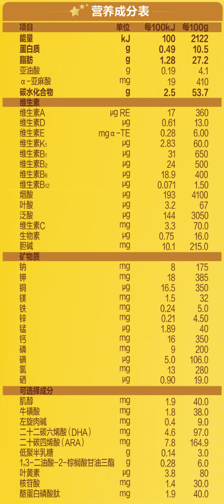 | 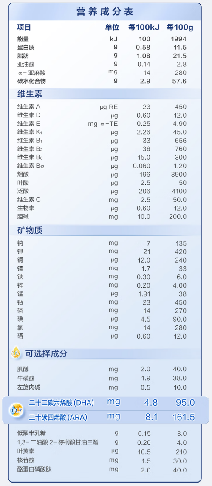 | 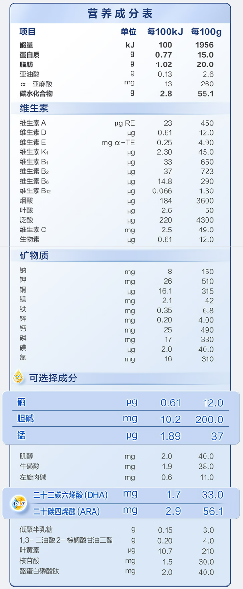 |

| **品牌**     | [完达山 元乳臻益](https://item.jd.com/100174268941.html#switch-sku) |   |   | [完达山 菁稚非凡 A2型](https://item.jd.com/100028664399.html#switch-sku) |   |   |
| ---- | ---- | ---- | ---- | ---- | ---- | ---- |
| **奶源**     | 黑龙江 |   |   | 黑龙江 |   |   |
| **奶基**     | 生牛乳 | 脱盐乳清粉 | 食用植物调和油 | 生牛乳 | 脱盐乳清粉 | 食用植物调和油 |
| **段数**     | 1段， 228/800g | 2段， 228/800g | 3段， 228/800g | 1段， 274/750g | 2段， 274/750g | 3段， 274/750g |
| **营养成分**| 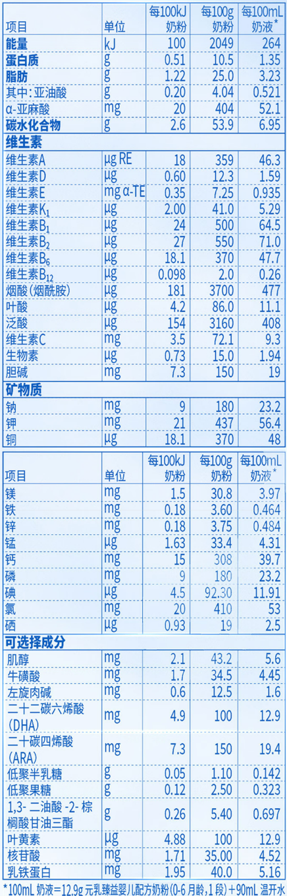 | 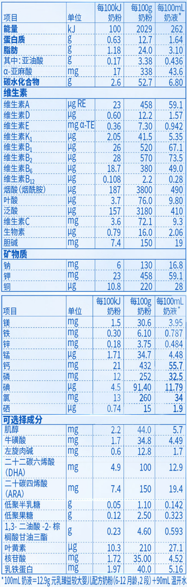 | 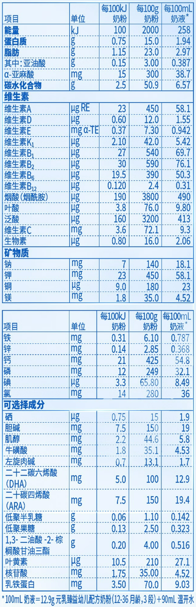 | 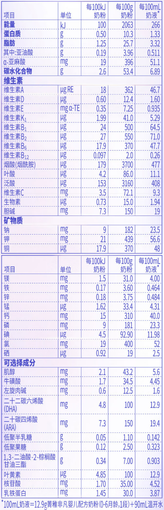 | 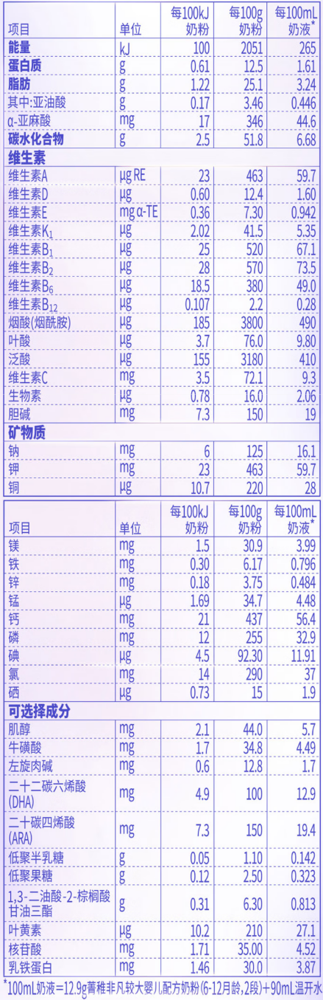 | 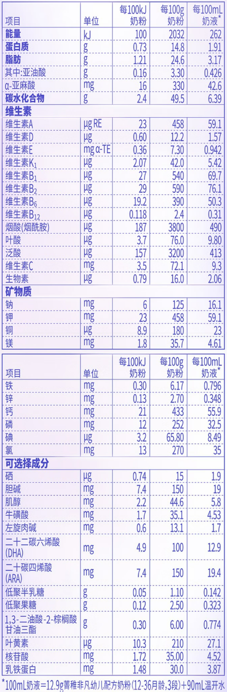 |

| **品牌**     | [爱他美（Aptamil）卓徉（羊奶粉）](https://item.jd.com/100054585561.html#none) |                                                              |                                                              | **[爱他美-卓傲](https://item.jd.com/100057735310.html)**     |                                                              |                                                              |
| ------------ | ------------------------------------------------------------ | ------------------------------------------------------------ | ------------------------------------------------------------ | ------------------------------------------------------------ | ------------------------------------------------------------ | ------------------------------------------------------------ |
| **奶源**     | 欧洲                                                         |                                                              |                                                              | 荷兰                                                         |                                                              |                                                              |
| **奶基**     | 高油脱盐羊乳清粉                                             | 全脂羊乳粉                                                   | 乳糖                                                         | 1. 脱盐乳清粉                                                | 2. 脱脂牛奶                                                  |                                                              |
| **段数**     | 1段                                                          | 2段                                                          | 3段                                                          | 1段                                                          | 2段                                                          | 3段                                                          |
| **营养成分** | 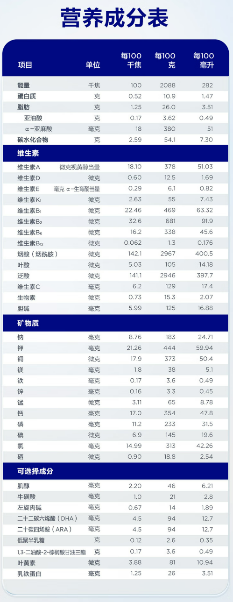 | 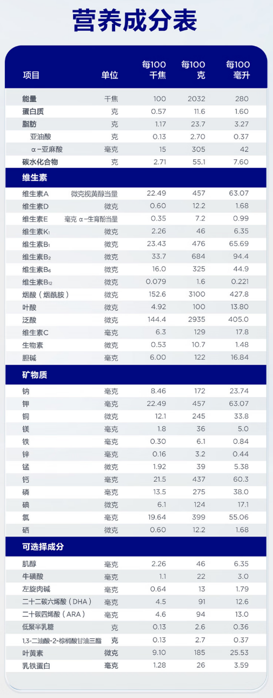 | 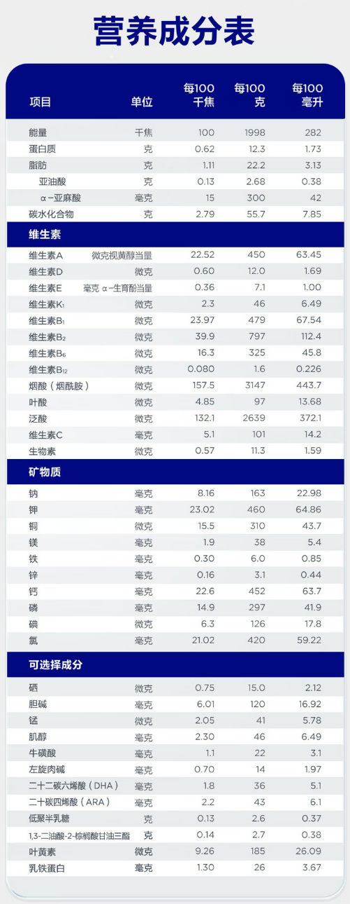 |  |  |  |


| **品牌**     | [a2-至初](https://item.jd.com/4029643.html)                  |                                                              |                                                              | [美赞臣-蓝臻](https://item.jd.com/100054910087.html)         |                                                              |                                                              |
| ------------ | ------------------------------------------------------------ | ------------------------------------------------------------ | ------------------------------------------------------------ | ------------------------------------------------------------ | ------------------------------------------------------------ | ------------------------------------------------------------ |
| **奶源**     | 新西南                                                       |                                                              |                                                              | 荷兰                                                         |                                                              |                                                              |
| **奶基**     | 1. 生牛乳                                                    | 2. 脱脂生牛乳                                                | 3. 乳糖                                                      | 1. 乳糖                                                      | 2. 棕榈液油                                                  | 3. 脱脂乳粉                                                  |
| **段数**     | 1段                                                          | 2段                                                          |                                                              | 1段                                                          | 2段                                                          |                                                              |
| **营养成分** |  |  |                                                              |  |  |                                                              |

| **品牌**     | [惠氏 启赋蕴淳A2](https://item.jd.com/100043138444.html)     |                                                              |                                                              | [惠氏 启赋未来10HMO](https://item.jd.com/100235320622.html)  |                                                              |                                                              |
| ------------ | ------------------------------------------------------------ | ------------------------------------------------------------ | ------------------------------------------------------------ | ------------------------------------------------------------ | ------------------------------------------------------------ | ------------------------------------------------------------ |
| **奶源**     | 爱尔兰                                                       |                                                              |                                                              | 欧洲进口                                                     |                                                              |                                                              |
| **奶基**     | 乳糖                                                         | 脱脂乳粉                                                     | 1,3-二油酸 2-棕榈酸甘油三酯                                  | 脱脂牛奶                                                     | 乳糖                                                         | 植物油                                                       |
| **段数**     | 1段， 355/810g                                               | 2段， 348/810g                                               | 3段， 338/810g                                               | 1段， 292/800g                                               | 2段， 263/800g                                               | 3段， 235/800g                                               |
| **营养成分** | 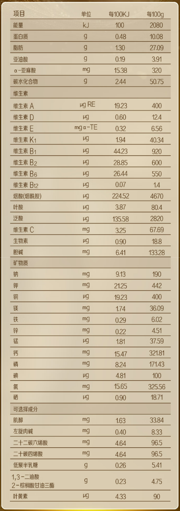 | 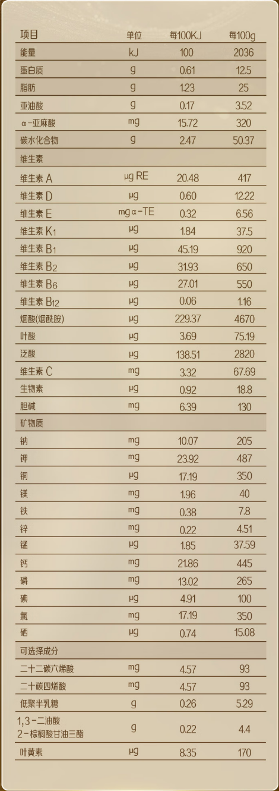 | 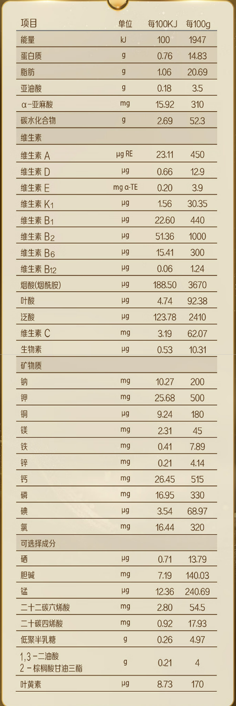 | 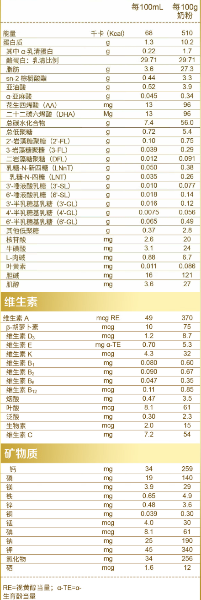 | 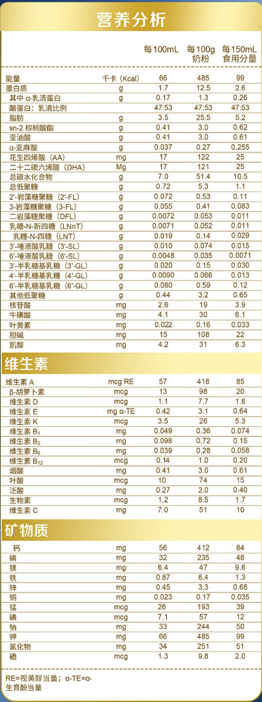 | 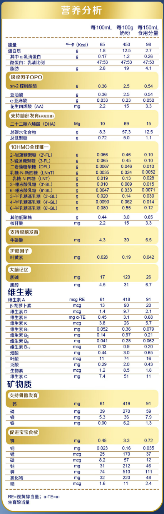 |

| 品牌         | **[a2- 澳洲紫白金](https://npcitem.jd.hk/100030631099.html)** |                                                              |                                                              | **[美素佳儿-港版皇家](https://npcitem.jd.hk/100005794942.html)** |                                                              |                                                              |
| ------------ | ------------------------------------------------------------ | ------------------------------------------------------------ | ------------------------------------------------------------ | ------------------------------------------------------------ | ------------------------------------------------------------ | ------------------------------------------------------------ |
| **奶源**     | 新西南                                                       |                                                              |                                                              | 荷兰                                                         |                                                              |                                                              |
| **奶基**     | 1. 脱脂牛奶                                                  | 2. 乳糖                                                      |                                                              | 1. 全脂牛奶                                                  | 2. 脱碘物乳清                                                |                                                              |
| **段数**     | 1段， 229/900g                                               | 2段， 229/900g                                               | 3段， 209/900g                                               | 1段， 353/800g                                               | 2段， 321/800g                                               | 3段， 294/800g                                               |
| **营养成分** |  |  |  |  |  |  |

| **品牌**     | [爱他美（Aptamil）德国白金版](https://npcitem.jd.hk/100015079139.html#crumb-wrap) |                                                              |                                                              | [合生元 派星](https://item.jd.com/1720648.html)              |                                                              |                                                              |
| ------------ | ------------------------------------------------------------ | ------------------------------------------------------------ | ------------------------------------------------------------ | ------------------------------------------------------------ | ------------------------------------------------------------ | ------------------------------------------------------------ |
| **奶源**     | 德国？                                                       |                                                              |                                                              | 法国                                                         |                                                              |                                                              |
| **奶基**     | 乳糖                                                         | 脱脂牛奶                                                     | 无水乳脂                                                     | 脱脂牛乳                                                     | 乳糖                                                         | 混合油脂                                                     |
| **段数**     | 1段， 218/800g                                               | 2段， 240/800g                                               | 2段+， 205/800g                                              | 1段， 318/800g                                               | 2段， 318/800g                                               | 3段， 318/800g                                               |
| **营养成分** | 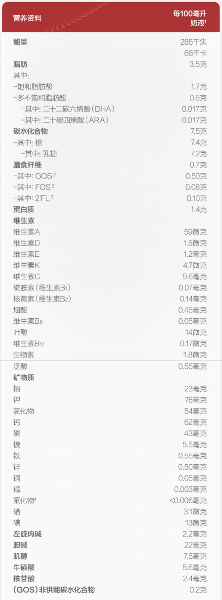 | 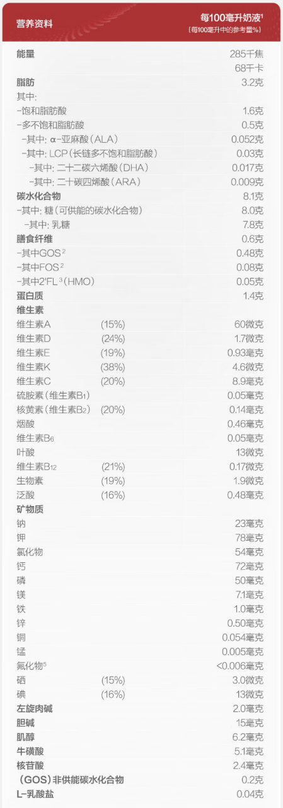 | 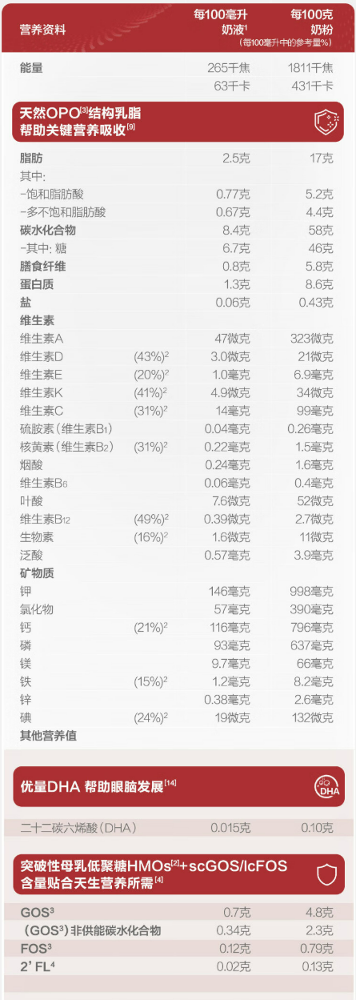 | 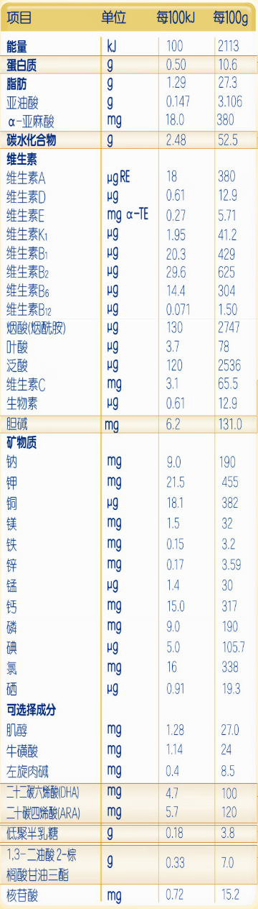 | 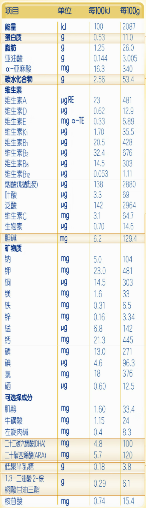 | 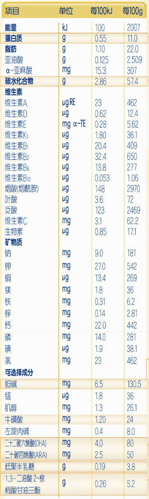 |

| **品牌**     | [合生元 爱斯时光 有机](https://item.jd.com/8764007.html)     |                                                              |                                                              |      |      |      |
| ------------ | ------------------------------------------------------------ | ------------------------------------------------------------ | ------------------------------------------------------------ | ---- | ---- | ---- |
| **奶源**     | 法国                                                         |                                                              |                                                              |      |      |      |
| **奶基**     | 脱脂牛乳                                                     | 脱盐乳清粉                                                   | 植物调和油                                                   |      |      |      |
| **段数**     | 1段， 298/700g                                               | 2段， 298/700g                                               | 3段， 298/700g                                               | 1段  | 2段  | 3段  |
| **营养成分** | 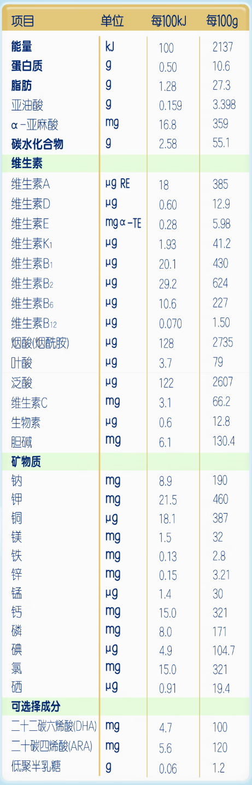 | 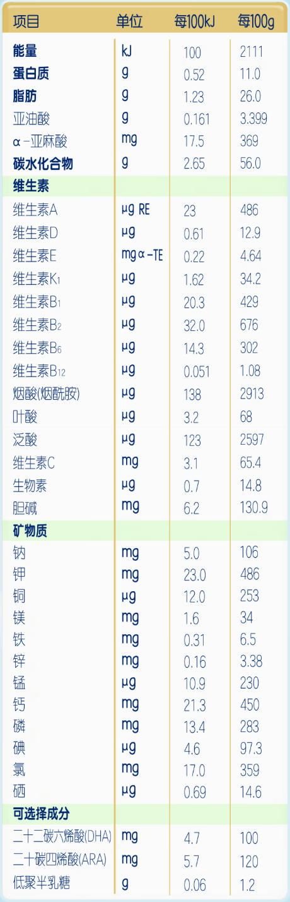 | 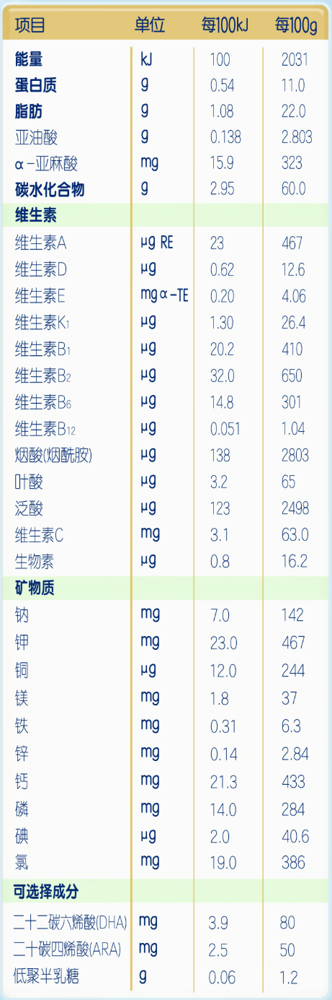 |      |      |      |


```

| **品牌**     |   |   |   |   |   |   |
| ---- | ---- | ---- | ---- | ---- | ---- | ---- |
| **奶源**     |   |   |   |   |   |   |
| **奶基**     |   |   |   |   |   |   |
| **段数**     | 1段 | 2段 | 3段 | 1段 | 2段 | 3段 |
| **营养成分**|    |   |   |   |   |    |


```

