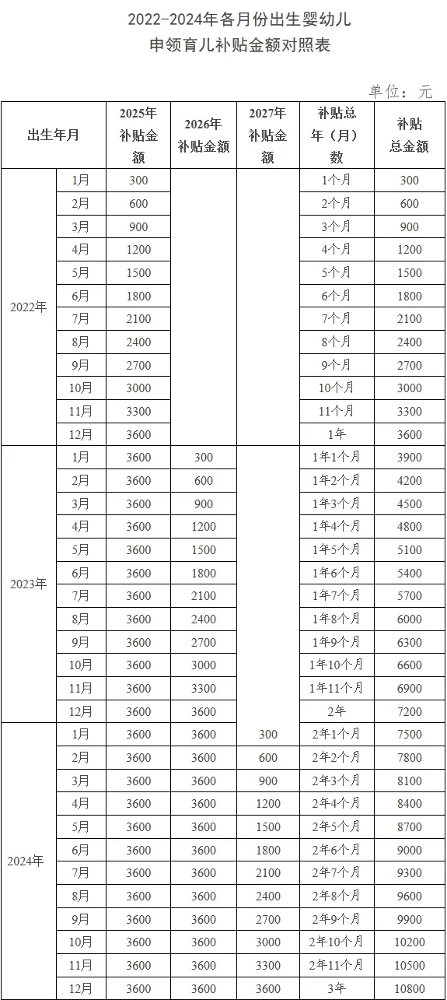

## 一、孕期优惠政策

### (一) 职工生育保险——产前检查费用报销

参加职工医保的人员，同步就参加生育保险。生育保险费由用人单位缴纳，职工个人不用缴纳。

参保人员享受的生育保险待遇，包括生育医疗费用、产前检查费、计划生育医疗费用、法律法规规定的其他项目费用、生育津贴。

其中，**产前检查费用报销** 的额度目前是 500 元。

在 **医院进行产科产前检查时，通知缴费窗口核算产检检查报销**，根据当次检查费用 **按比例扣除报销额度，累计报销 500 元**。

## 二、育儿优惠政策

### (一) 3岁以下婴幼儿照护专项附加扣除

为了让纳税人尽快享受减税红利，税务部门已全面做好各项准备工作，专扣填报系统功能已于2022年3月28日升级。

2022年3月29日起，符合条件的纳税人即**可通过手机个人所得税APP填报3岁以下婴幼儿照护专项附加扣除**了，不方便自行填报的也可以将有关信息提交给**任职单位**代为填报。

3岁以下婴幼儿照护专项附加扣除可以在单位每月发工资的时候享受，也可以在 次年汇算时一并享受。

该项政策规定，自2022年1月1日起，纳税人照护3岁以下婴幼儿子女的相关支出，在计算缴纳个人所得税前按照每名婴幼儿每月1000元的标准定额扣除，也就是一年12000。

具体扣除方式上，可选择由 **夫妻一方按扣除标准的100%扣除**，也可选择 **由夫妻双方分别按扣除标准的50%扣除**。

监护人不是父母的，包括生父母，继父母、养父母、父母之外的其他法定监护人，也可以按上述政策规定扣除。

3岁以下婴幼儿照护专项附加扣除与其他六项专项附加扣除一样，实行 “**申报即可享受、资料留存备查**” 的服务管理模式。

纳税人在申报享受时，可通过手机个人所得税APP填报或向单位提供婴幼儿子女的姓名、证件类型及号码、以及本人与配偶之间扣除分配比例等信息即可，**无需向税务机关报送证明资料**。

纳税人需要将子女的出生医学证明等资料 留****存备查。

### (二) 3周岁以下婴幼儿育儿补贴

#### 1、补贴对象

从2025年1月1日起，对符合法律法规规定生育的3周岁以下婴幼儿发放补贴，至其年满3周岁。补贴对象应当具有中华人民共和国国籍。

根据方案，补贴对象为从2025年1月1日起，符合法律法规规定生育的3周岁以下婴幼儿。换言之，无论一孩、二孩、三孩，均可申领育儿补贴。

#### 2、补贴标准

育儿补贴按年发放，育儿补贴国家基础标准为每孩每年3600元，至其年满3周岁。

（1）对于**2025年1月1日及以后**出生的婴幼儿，可**连续申领3年补贴**，共计10800元。

（2）对于**2025年1月1日之前出生且未满3周岁**的婴幼儿，可按**应补贴月数折算补贴**金额。具体算法见下表。

#### 3、其他事项

1.  申请育儿补贴**以家庭为单位**，由申请家庭确定1名申领人。申领人应当符合以下条件之一：
   - 婴幼儿父母一方，包括生父母、养父母；父母离异的，由父母亲中具有抚养权的一方申领育儿补贴。
   - 婴幼儿父母作为监护人缺失的，由其他监护人申领。
2.  需要提供以下信息：
   - 婴幼儿基本情况：婴幼儿姓名、证件类型及号码、出生日期、性别、孩次信息、户籍地址。
   - 申领人基本情况：姓名、证件类型及号码、手机号、现居住地址、与婴幼儿的关系。
   - 收款账户类型及账户信息。
3.  如何提交育儿补贴申请：
   - 以线上申请为主，申领人可通过支付宝、微信平台“育儿补贴”小程序，或婴幼儿户籍所在省份的政务服务平台，进入育儿补贴申领专区，登录“育儿补贴信息管理系统”申请。
   - 线下申请需要到婴幼儿户籍所在地乡镇政府（街道办事处）现场办理。
4.  相关优惠政策：
   - 对按照育儿补贴制度规定发放的育儿补贴 **免征个人所得税**。
   - 在最低生活保障对象、特困人员等救助对象认定时，育儿补贴 **不计入家庭或个人收入**。

### （三）生育津贴

#### 1、说明

生育津贴即为**产假工资**，相当于女职工在生育期间的工资。生育津贴高于本人产假工资标准的，用人单位不得克扣；生育津贴低于本人产假工资标准的，差额部分由用人单位补足。

按照地区的不同，有的地区生育津贴直接发放给个人，也有的地区生育津贴由医保经办机构发放给用人单位，再由用人单位发放给个人。

为让符合条件的参保女职工能够更便捷、更快速地享受到生育津贴，国家医保局积极推动有条件的地区将生育津贴按程序直接发放给个人，让参保女职工在生育期间第一时间得到经济支持，切实减轻家庭生育负担。

#### 2、计算方式

**生育津贴=用人单位月人均缴费基数÷30天×产假天数**。

> 不同地方的生育津贴计算的产假天数不同，并且这里的产假天数与实际的休假天数并 **不一定相同**。

重庆地区：

**1.正常生育** ：**生育津贴=单位上年月平均缴费工资/30天×128天** (难产增加津贴15天;多胞胎生育的，每多生育一个婴儿，增加津贴15天。)

**2.怀孕4个月以下流产：**生育津贴=单位上年月平均缴费工资/30天×15天。

**3.怀孕4个月以上流产或引产：**生育津贴=单位上年月平均缴费工资/30天×42天。

**4.宫外孕：**生育津贴=单位上年月平均缴费工资/30天×30天。

